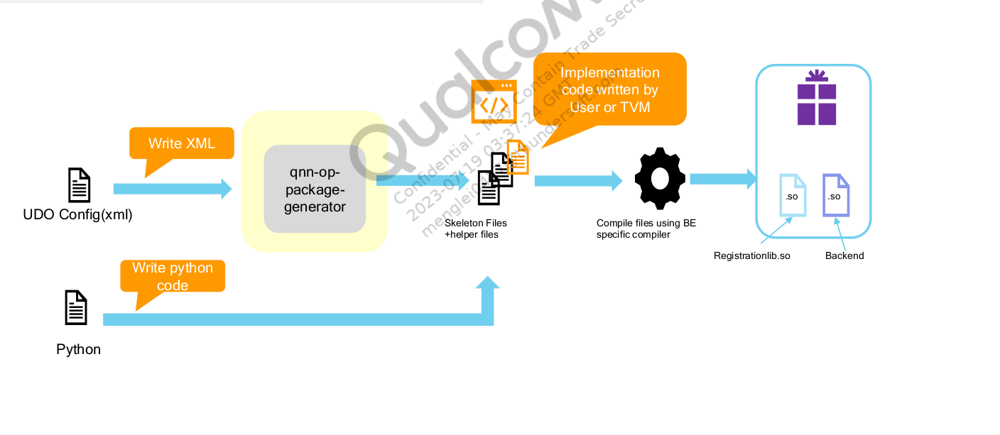

# QNN-UDO Guide

80-58216-2 Rev. AA

## Define UDO

**There are 2 methods to define UDO.**

- Writing xml config and use qnn-op-package-generator to generate udo package.
- Writing a python script to call aisw API to generate udo package .

