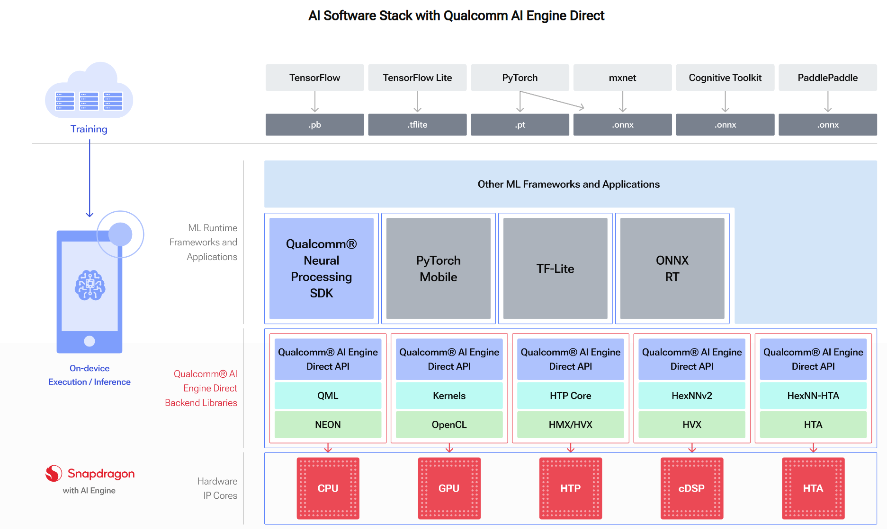

# QNN Overview

| eNGLISH                                                      | CHINA                | SHORT |
| ------------------------------------------------------------ | -------------------- | ----- |
| Qualcomm Technologies Inc                                    | 高通股份有限公司     | QTI   |
| Qualcomm® [AI Engine Direct](introduction.html#qnn-ai-engine-note) architecture | 高通边缘人工智能框架 |       |
|                                                              |                      |       |
|                                                              |                      |       |
|                                                              |                      |       |
|                                                              |                      |       |
|                                                              |                      |       |
|                                                              |                      |       |

---

Qualcomm® [AI Engine Direct](introduction.html#qnn-ai-engine-note) architecture is designed to provide an unified API and modular and extensible per-accelerator libraries which form a reusable basis for full stack AI solutions, both QTI’s own and third party frameworks (as illustrated with [AI Software Stack with Qualcomm AI Engine Direct](#qnn-sw-stack-figure) diagram).

## Features

**Modularity based on hardware accelerators**

The Qualcomm® [AI Engine Direct](introduction.html#qnn-ai-engine-note) architecture is designed to be modular and allows for clean separation in the software for different hardware cores/accelerators such as the CPU, GPU and DSP that are designated as *backends*.

The Qualcomm® AI Engine Direct backends for different hardware cores/accelerators are compiled into individual core-specific libraries that come packaged with the SDK.

**Unified API across IP Cores**

One of the key highlights of Qualcomm® [AI Engine Direct](introduction.html#qnn-ai-engine-note) is that it provides a unified API to delegate operations such as graph creation and execution across all hardware accelerator backends. This allows users to treat Qualcomm® [AI Engine Direct](introduction.html#qnn-ai-engine-note) as a hardware abstraction API and port applications easily to different cores.

**一定级别的抽象**

The Qualcomm® [AI Engine Direct](introduction.html#qnn-ai-engine-note) API 旨在支持高效的执行模型， 内部有一些图优化等功能。但与此同时，这遗漏了更广泛的功能，例如模型解析和网络分区到更高界别的框架。

**可扩展算子**

支持客户集成自定义算子，以便与内置算子无缝协作。

**提高执行效率**

凭借优化网络加载和异步执行支持，能为机器学习框架提供高效的接口，以便在所需的硬件加速器上加载和执行网络。

## Software Architecture

### Device

硬件