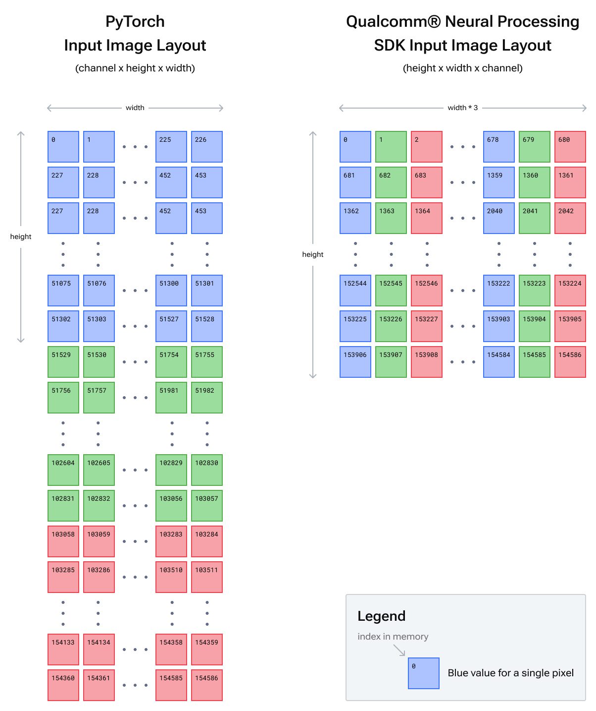

# Input Image Formatting

除了转换模型外， SNPE还要求输入图像采用与pytorch不同的特定格式。

Pytorch的图像被表示为张量，其格式为 **batch \* channel \* height \* width **， 其中宽度是变化最快的通道，之后是高度、颜色通道、batch通道。**这意味着一张图片在内存是是连续的。**

在SNPE中，图像必须要以**batch \* height \* width \* channel **， 这意味着单个像素在所有的颜色通道中是连续的，然后是下一个像素的所有颜色值。

Note:

在推理阶段使用的channel顺序必须要与训练期间使用的channel顺序相同。例如，在某些框架中的Imagenet模型可能需要BGR的通道顺序。

MNIST模型的输入图像

某些框架中的MNIST模型如lenet需要的是28*28大小的单通道灰度图像，请注意虽然只有一个通道，但是这些框架中仍然是需要一个4维的输入张量的（1\*1\*28\*28）

输出

示例的输出在Pytorch和SNPE之间保持相同：对于批处理中的每个图像，一个一维度张量包含每一个类的概率。

对于Imagenet 模型而言， 是一个size为1000的tensor, 对应1000个类的可能性。

