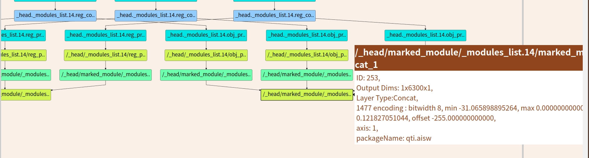
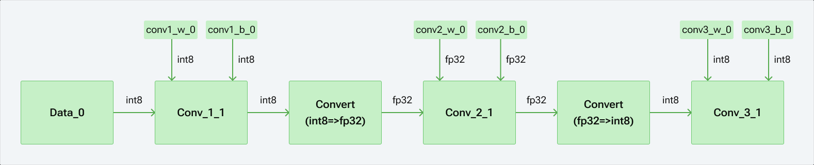

# 量化算法

本节主要介绍SDK中使用的量化算法背后的概念。这些概念由`snpe-dlc-quantize`使用， 并且SDK在使用DSP运行时也是用这些概念进行输入量化。

## overview

`SDK支持多种量化模型。 此处描述了无论模型如何量化的基础知识。` 有关详细信息，请参阅量化模式。

- 量化将浮点数据转换成tensorflow 格式的8-bit 定点格式。

- 满足下面需求

  - 覆盖全部的输入值范围
  - 强制执行最小范围位0.0001.
  - 浮点值0可以精确表示

- 量化算法输入

  - 要量化的浮点值集

- 量化算法的输出

  - 8 bit 定点值集
  - 编码参数
    - encoding-min: 可以表示的最小浮点值 （通过定点值0）
    - encoding-max: 可以表示的最大浮点值（通过定点值255）

  

- 算法

  1. 计算输入数据的真实范围 （最小值，最大值）
  2. 计算最小编码和最大编码
  3. 量化输入的浮点值
  4. 输出
     - fixed point values
     - enconding min 和 encoding max 参数。

## Details

本节概述了有关量化过程的更多信息。

1. 计算输入浮点值的范围

   - 查找输入数据的最大值和最小值。
   - 表示输入数据的真实范围

2. 计算enconding-min 和 enconding-max

   - 这些参数将会用在量化步骤中。
   - 这些定义了定点格式可以表示的范围和浮点值
   - endconding-min ： 指定由定点值0表示的最小浮点值
   - enconding-max： 指定由定点值255表示的最大浮点值。
   - 每个步长的浮点值，其中步长 = (编码最大 - 编码最小) / 255

   1. 首先将encoding-min和encoding-max设置为上一步中计算出的真实最小值和真实最大值

   2. 第一个要求：编码范围必须至少为 0.0001

      coding-max调整位max(true max, true min + 0.01)

   3. 第二个要去是: 浮点值0必须能够精确表示

   4. 可以进一步调整encoding-min 和 enconding-max

3. **处理0**

   - 情况1  输入严格位正

     编码最小值设置为0.0， 浮点值可以用最小定点值0表示。

     例如 输入范围=[5.0, 10.0]

     编码最小值=0.0， 编码最大值为10.0

   - 情况2 输入严格为负

     编码最大值设置为0.0， 

     浮点值可以由最大定点值255精确表示

     例如输入范围=【-20.0， -6.0】

     编码最小值为-20.0， 最大值为0.0

   - 情况三： 输入既有负数又有正数

     编码的最小值和编码最大值稍微移动，以使浮点零可以精确表示。

     例如输入范围 = [-5.1, 5.1]

     首先将endconding-min和enconding-max分别设置为-5.1和5.1

     编码的范围为10.2, 步长为10.2/255 = 0.04

     零目前无法表示， 定点值127和128克表示的最接近值为-0.02, +0.02

     enconding-min 和enconding-max偏移-0.02， 新的鞭名马最小值为-5.12， 最大编码值为5.08， 浮点值0现在可以用定点值128表示。

4. 量化输入浮点值

   上一步中去欸的那个的encoding-min 和 encoding-max  参数用于将所有输入浮点值量化为定点表示。

   量化公式为
   $$
   Quantized\ value = round(\frac{255*(float point value - endcoding.min)}{encoding.max - encoding.min})
   $$
   量化的值的被限制在0， 255之间。

5. Outputs

   the fixed point values

   encoding-min and encoding-max parameters

## 量化例子

- 输入

  输入的数值 = [-1.8, -1.0, 0, 0.5]

- 编码范围为2.3，大于要求的0.0001

  编码最小值调整为−1.803922，编码最大值调整为0.496078，以使零可以精确表示

  步长（增量或比例）为 0.009020

  输出：

  量化值为 [0, 89, 200, 255]

## Dequantization Example

Inputs:

quantized values = [0, 89, 200, 255]

encoding-min = −1.803922, encoding-max = 0.496078

step size is 0.009020

Outputs:

dequantized values = [−1.8039, −1.0011, 0.0000, 0.4961]


## Bias BitWidth

目前支持权重和偏差的默认量化宽度是8。可以通过从 `snpe-dlc-quantize` 指定命令行选项“–bias_bitwidth 32”来覆盖偏置位宽以使用 32 位量化。 对于某些模型，使用 32 位偏差可能会稍微提高准确性。 不幸的是，很难预测哪些模型可以从中受益，因为模型架构、权重分布等都会对量化性能产生影响。

## 激活函数的位宽

SNPE也支持16位宽的激活函数。

要启用16位定点推理，请将激活函数的量化宽度设置为16， 同时将权重的位宽保持位8；在`snpe-dlc-quantize`中设置命令选项 `--act_bitwideth 16` ， `--weights_bitwidth 8`， 将生成量化文件具有16位激活和8位权重。

建议使用Userbuffer TF16作为输入/输出数据格式, 以获得更好的效率。在这种情况下，如果使用浮点数据，用户需要自行量化/反量化输入输出数据。使用snpe-net-run 进行测试时， 可以使用命令行`--userbuffer_tfN 16`来选择UserBuffer TF16 模式。 ITensor和UserBuffer浮点格式可以与16位正数推理一起使用， 但是内部应用的量化效率较低。

## 量化模式

SDK支持多种量化模式，区别在于量化参数的选择方式。

## 默认的量化模式

它使用正在量化的数据的真实最小值/最大值，然后调整范围以确保最小范围并确保 0.0 是精确可量化的。

## 增强量化模式

增强量化模式（通过使用`snpe-dlc-quantize`的 `--usr_enhanced_quantizer`参数调用）使用一组算法尝试确定一组更好的量化参数以提高准确性。该算法可能于默认量化器不同的最大值/最小值， 并且在某种情况下，可能会设置范围，使得一些原始权重或者激活不能落入该范围。然而，这个范围确实比简单地使用真实的最小值/最大值产生更好的精度。 通过在选项后附加`weights`或`activations`，可以独立启用增强量化器的权重和激活。

这对于权重和激活看可能具有长尾的某些模型很有用， （想象一个范围，其中大多数值在 -100 到 1000 之间，但少数值远大于 1000 或远小于 -100。）在某些情况下，可以忽略这些长尾，并且可以更有效地使用范围 -100, 1000 比全系列。

增强型量化器仍然强制执行最小范围并确保 0.0 是精确可量化的。

## 调整权重量化模式

这种模式仅对于权重量化位8bit定点(通过使用`snpe-dlc-quantize`的`--use_adjusted_weights_quantizer`调用)， 它使用正在量化的数据的调整后的最大值和最小值， 而不是真正的最大值和最小值排除长尾后的最大值和最小值。

调整后的权重量化器仍然强制执行最小范围并确保 0.0 是完全可量化的。

## 增强量化技术

由于训练技术、模型架构和层类型多种多样，量化可能是一个很难解决的问题。 为了缓解量化问题，snpe-dlc-quantize 中添加了两种新的模型预处理技术，可以提高量化精度急剧下降的模型的量化性能。

引入的新技术是CLE（跨层均衡）（Cross Layer Equalization）.

`CLE 的工作原理是利用激活函数的尺度等方差性质来缩放网络中的卷积权重范围。` 

此外，该过程吸收了可能由于从一个卷积层到后续卷积层的权重缩放而导致的高偏差。

## 增强量化技术 局限性

在很多情况下， CLE可以使得量化的模型接近于其原始浮点精度，当前的算法有一些警告/限制。

1. CLE对特定算子模式进行操作， 这些算子全部存在于单个分支中， 输出不能被多个消费。匹配模式为

   - Conv(r)->Batchnorm(r)->activation(o)->Conv(r)->Batchnorm(r)->activation(o)

   - Conv(r)->Batchnorm(r)->activation(o)->DepthwiseConv(r)->Batchnorm(r)->activation(o)->Conv(r)->Batchnorm(r)->activation(o)

2. CLE算法目前仅仅支持Relu激活。 任何Relu6激活函数都会自动更改为Relu, 除此之外的任何激活函数都会导致算法忽略前面的卷积。 通常， 从Relu6到Relu的切换是无害的， 不会导致精度下降， 但是某些模型可能会出现轻微的精度下降。 在这种情况下， CLE只能将精度恢复到降低的水平，而不能恢复到原始浮点精度。

3. CLE 要求在转换为 DLC 之前原始模型中存在批规范（特别是可检测的批规范 beta/gamma 数据），以便运行完整的算法并重新获得最大精度。 对于 Tensorflow，即使使用折叠批量规范，有时仍然可以找到 beta 和 gamma，只要折叠没有将参数折叠到卷积的静态权重和偏差中。 如果它没有检测到所需的信息，您可能会看到类似以下的消息：“HBA 量化算法模型无效。” 这表明该算法将仅部分运行，并且可能存在准确性问题。

## 量化影响

量化模型或者在DSP上运行模型的时候， 可能会影响准确度。某些模型在量化时，可能无法工作，并且可能产生不正确的结果。用于衡量对分类模型影响的指标通常是`平均精度`, `Top-1 误差`和`Top-5误差`。

## Mixed Precision 和 FP16支持

 混合精度允许统一图中的不同操作指定为不同的位宽(例如8和16)或者数据类型（整数或浮点）。当连续操作之间的激活精度或数据类型不同时，会自动插入数据类型转换操作。 图形可以混合使用浮点和定点数据类型。 每个操作可以具有不同的权重和激活精度。 然而，对于特定操作，所有输入、输出和参数（权重/偏差）都将是浮点或全部将是定点格式。

## 量化覆盖

如果在转换期间提供了模型转换选项`--quantization_overrides`, 用户可以提供带有用于量化的参数json文件，这些将与模型一起缓存，并可用于覆盖转换中携带的任何量化数据（例如TF fake quantization）或者在`snpe-dlc-quantize`正常量化过程中计算数据。要在snpe-dlc-quantize期间覆盖参数， 必须传递`--override_params`, 并且将使用缓存的值。

json格式是根据AIMET规范定义的， 可以在下面找到

```json
{
  "activation_encodings": {
      "Conv1:0": [
          {
              "bitwidth": 8,
              "max": 12.82344407824954,
              "min": 0.0,
              "offset": 0,
              "scale": 0.050288015993135454
          }
      ],
      "input:0": [
          {
              "bitwidth": 8,
              "max": 0.9960872825108046,
              "min": -1.0039304197656937,
              "offset": 127,
              "scale": 0.007843206675594112
          }
      ]
  },
  "param_encodings": {
      "Conv2d/weights": [
          {
              "bitwidth": 8,
              "max": 1.700559472933134,
              "min": -2.1006477158567995,
              "offset": 140,
              "scale": 0.01490669485799974
          }
      ]
  }
}
```

如上json中有两个部分，

- 一个用于覆盖`算子输出`编码的部分，称为`activation_encodings`.

- 一个是用于覆盖参数(权重和偏差)编码的部分， 称为 `param_encodings`

上面的例子中， `activation_encodings` (例如 `Conv1:0`)表示应该覆盖量化的`输出张量的名称`。 `param_encodings` 表示为其指定编码的权重或者偏差。

常见参数简单细分：

- `bitwidth(int required)` 用于量化的位宽， 请注意，这与运行运行模型的运行时的现有位宽支持相匹配。
- `max(float required)` 分布或所需要范围的最大数字。
- `min(float required)` 分布或所需范围内最小的数字。
- `offset(int)` 指示零点的证书偏移量（即`精确表示0的点`）。
- `scale(float)` 指示整数大小除以所需分布范围的值。

`Note`： 不需要提供scale和offset。 如果提供了他们，将会使用它们，否则根据位宽，最大值和最小值参数去计算它。

`NOTE`： 激活时的量化位宽为16， 从Snapdragon 865/765起某些运行时支持，目前并不适用于所有操作。

Float16（半精度）还可以将整个模型转换为 FP16，或者在混合精度图形包含浮点和整数运算的情况下，在浮点运算的 FP16 和 FP32 数据类型之间进行选择。 下面描述了使用混合精度的不同模式。

- 无覆盖 如果编码文件中没有给出`--quantization_overrides`， 则所有的`算子输出`也就是`activations` 均按照`--act_bitwidth ` (default `8`)进行量化， 并且分别按照`--weigt_bitwidth/--bias_bitwidth` 默认时8进行量化

- 完全覆盖： 如果给出 `--quantization_overrides`标志以及指定模型中所有operator的编码文件，在这种情况下， 对于根据编码文件定义为整数/浮点的所有操作， 位宽将根据JSON设置。

- 部分覆盖： 如果`--quantization_overrides`标志与指定部分编码文件一起给出，则会发生下面的情况：

  我们展示了具有 3 个 Conv2d 操作的网络的示例 json。 第一个和第三个 Conv2d 操作是 INT8，而第二个 Conv2d 操作标记为 FP32。 FP32 操作（即 conv2_1）夹在“activation_encodings”中的两个 INT8 操作之间，因此转换操作将插入到 FP32 操作之前和之后。 conv2_1 相应的权重和偏差也在“param_encodings”中的 JSON 中标记为浮点型。



```json
{
       "activation_encodings": {
           "data_0": [
               {
                   "bitwidth": 8,
                   "dtype": "int"
               }
           ],
           "conv1_1": [
               {
                   "bitwidth": 8,
                   "dtype": "int"
               }
           ],
           "conv2_1": [
               {
                   "bitwidth": 32,
                   "dtype": "float"
               }
           ],
           "conv3_1": [
               {
                   "bitwidth": 8,
                   "dtype": "int"
               }
           ]
       },
       "param_encodings": {
           "conv1_w_0": [
               {
                   "bitwidth": 8,
                   "dtype": "int"
               }
           ],
           "conv1_b_0": [
               {
                   "bitwidth": 8,
                   "dtype": "int"
               }
           ],
           "conv2_w_0": [
               {
                   "bitwidth": 32,
                   "dtype": "float"
               }
           ],
           "conv2_b_0": [
               {
                   "bitwidth": 32,
                   "dtype": "float"
               }
           ],
           "conv3_w_0": [
               {
                   "bitwidth": 8,
                   "dtype": "int"
               }
           ],
           "conv3_b_0": [
               {
                   "bitwidth": 8,
                   "dtype": "int"
               }
           ]
       }
    }
```

json 中不存在的操作将被假定为定点，并且将分别根据 `–act_bitwidth/–weight_bitwidth/–bias_bitwidth `选择位宽度。

```shell
{
       "activation_encodings": {
           "conv2_1": [
               {
                   "bitwidth": 32,
                   "dtype": "float"
               }
           ]
       },
       "param_encodings": {
           "conv2_w_0": [
               {
                   "bitwidth": 32,
                   "dtype": "float"
               }
           ],
           "conv2_b_0": [
               {
                   "bitwidth": 32,
                   "dtype": "float"
               }
           ]
       }
    }
```

## 每个通道量化覆盖

每通道量化应用于作为 Conv 使用者（Conv2d、Conv3d、TransposeConv2d、DepthwiseConv2d）权重输入的张量。 本节提供了手动覆盖这些基于 Conv 的运算权重张量的每通道编码的示例。 

情况 1：没有每通道量化的非对称编码

```json
{
    "features.9.conv.3.weight": [
        {
            "bitwidth": 8,
            "is_symmetric": "False",
            "max": 3.0387749017453665,
            "min": -2.059169834735364,
            "offset": -103,
            "scale": 0.019991940143061618
        }
    ]
}
```

情况 2：具有 3 个输出通道的每通道量化编码

```shell
{
    "features.8.conv.3.weight": [
        {
            "bitwidth": 8,
            "is_symmetric": "True",
            "max": 0.7011175155639648,
            "min": -0.7066381259227362,
            "offset": -128.0,
            "scale": 0.005520610358771377
        },
        {
            "bitwidth": 8,
            "is_symmetric": "True",
            "max": 0.5228064656257629,
            "min": -0.5269230519692729,
            "offset": -128.0,
            "scale": 0.004116586343509945
        },
        {
            "bitwidth": 8,
            "is_symmetric": "True",
            "max": 0.7368279099464417,
            "min": -0.7426297045129491,
            "offset": -128.0,
            "scale": 0.005801794566507415
        }
    ]
}
```

