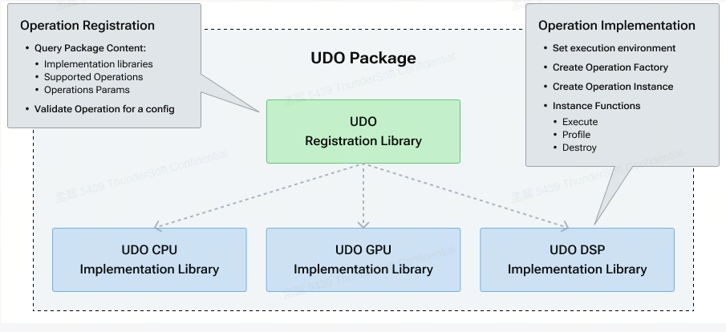
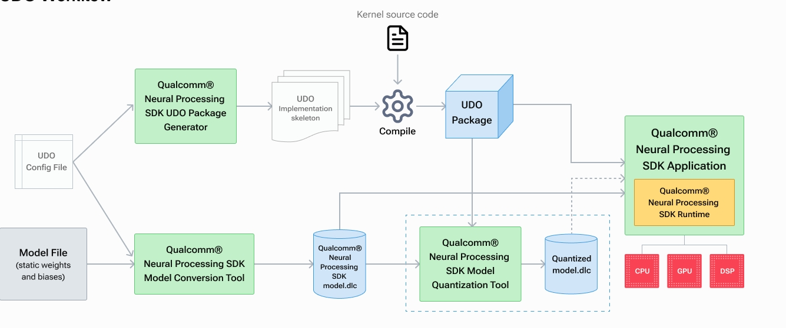

# User-defined Operations (UDO)

[TOC]

## 概览

SNPE 提供UDO的原因是：`对SNPE不支持的算子，提供给用户自定义该算子，实现部署的要求`。

`与执行内部支持的操作相比，几乎没有开销。`

### UDO 包剖析

`允许用户以动态库的形式提供UDO实现， 可以查询、加载和运用动态库。`

从上图中，可以看出UDO包由`注册组件`和`实现组件`组成。 通常是一个注册库和一组实现库(对一种硬件资源的实现)表示。注册库再ARM cpu上加载并执行。

## UDO 工作流

1. 识别模型中需要UDO的算子， 并通过配置文件描述其属性。具体格式在 [定义一个UDO]() 讲解。
   1. 利用`snpe-udo-package-generator`可帮助用户创建用于与 Qualcomm® 神经处理 SDK UDO API 接口的`通用框架代码`，

### 定义一个UDO