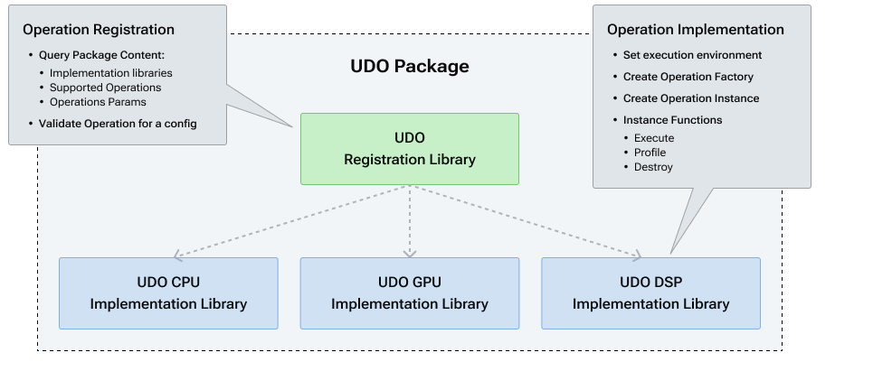
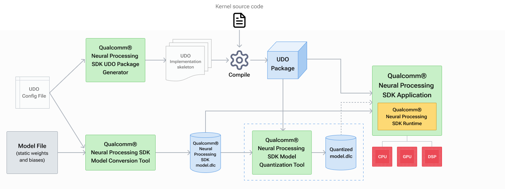

# UDO

[TOC]

## Overview of UDO

User-Defined Operation. 支持用户自定义SDK不支持的神经网络算子。SDK提供了无缝方式执行这些算子，与内部算子相比，几乎无额外的开销。

**Anatomy of a UDO package** UDO包的解剖

SDK允许用户以动态库的方式提供UDO实现，可以查询，加载和运用动态，以及使用该动态库定义的内核进行推理。

The figure below illustrates the concept of a UDO package:



从图中可以看出，**UDO包由注册组件和实现组件组成**。 它们通常用**一个注册库和一组实现库**分别表示，每个注册库对应一个实现内核可用的硬件加速器。 如果用户愿意，可以选择将这两个组件构建到一个库中。

**UDO workflow**



UDO 的流程

> 1.  Defining a UDO
>

## Defining a UDO

用户可以通过配置规范文件来表达自定义算子的属性。UDO配置使用JavaScript对象表示法（Json）语法格式来创建算子的描述。**配置文件定义了可以用键值对指定的字段，并按照JSON规则排列成树形结构。** **这些信息将用于时别框架模型内的操作，然后最终序列化到DLC模型中，这意味着配置中任何更改都需要重新生成DLC模型，以保证序列化正确的信息。**

UDO Config Field Description

```json
{
    "UdoPackage_0":
    {
        "Operators": [
            {
                "type": "",
                "inputs":[
                    {"name":"", "per_core_data_types":{"CPU":"FLOAT_32", "GPU":"FLOAT_32", "DSP":"UINT_8"},
                    "static": true, "tensor_layout": "NHWC"},
                    {"name":"", "data_type": "FLOAT_32",
                    "static": true, "tensor_layout": "NHWC"},
                ],
                "outputs":[
                   @ML111@},
                    {"name":"", "data_type": "FLOAT_32"}
                ],
                "scalar_params": [
                    {"name":"scalar_param_1", "data_type": "INT_32"}
                ],
                "tensor_params": [
                    {"name":"tensor_param_1", "data_type": "FLOAT_32", "tensor_layout": "NHWC"},
                ],
                "core_types": ["CPU", "GPU", "DSP"],
                "dsp_arch_types": ["v66", "v68", "v69", "v73"]
            }
        ],
        "UDO_PACKAGE_NAME": "MyCustomUdoPackage"
    }CD
}
```

**上面的描述只是一个通用配置文件，用于帮助定义用户可以填写的字段。 必填字段提供有特定值，而可选字段则用空字符串表示。** 请注意，可选字段仅意味着如果未提供则有默认值，或者将使用空字符串。 每个可用字段的完整详细信息按层次结构描述如下：

- **UdoPackage**  每个 UDO 包都可以描述为“UdoPackage_i”，其中 i 表示包的生成顺序。 用户也可以自由使用空字符串，但字典结构是必要的。可以在单个配置文件中定义多个 UDO 包。 

- **Operators**  这是特定UdoPackage的子节点，用于指示当前算子的数量。

  - **type** 算子的类型

  - **inputs:** 算子的输入张量列表， 每个输入都是一个字段对象。

    - **name:** 可选字段，描述输入张量的名称。 因为输入张量的名称是可变的， 因此用户可以不提供名称。

    - **per_core_data_type** 一个字段对象，指示输入张量的每个核心的数据类型。

      或者如果，用户希望在所有指定的内核中使用相同的数据类型，那么用户可以指定 **data_type** 代替**per_core_data_type**, 后跟数据类型，支持的数据类型有
    
      - FLOAT_16
      - FLOAT_32
      - FIXED_8
      - FIXED_4
      - FIXED_16
      - UINT_8
      - UINT_16
      - UINT_32
      - STRING

    - **static:** bool值。如果输入的数据是静态的， 例如数据是在模型中提供的，则需要设置这个bool字段。 如果输入张量包含输入，则需要设置此字段，否则输入将被动态处理，数据将不被序列化。

    - **tensor_layout:** 描述输入张量的规范维度格式的字符串字段。支持如下：
    
      - NCHW
      - NWCH

    - **outputs:** 算子的输出张量

    - **scalar_params:** 标量属性列表

      - **name:** 必填字段， 描述标量参数的名称

      - **data_type:** 必填字段， 描述该标量主持的数据类型
    
    - **tensor_params:** A list of tensor-valued attributes.2 3
    
    - **core_types:** The intended IP cores for this particular operation. The supported core_types:
      - CPU
      - GPU
      - DSP
      
    - **dsp_arch_types:** The intended DSP architecture types for DSP core type. The supported dsp_arch_types:
      - v65
      - v66
      - v68
      - v69
      - v73
    
    - **UDO_PACKAGE_NAME:** The name of the UDO Package, which can be any valid string.1

## Defining a UDO Package

**UDO Package 主要是由一个注册库和多个实现库组成。主要的想法是注册库包含算子性质的信息，实现库则包含执行算子所需要的操作。**

UDO Package可以由一个UDO配置文件定义，其中包括操作和路径的文本规范，最终帮助定义表示UDO包的目录结构。本节主要讲述UDO配置文件的定义。

```json
{
    "UdoPackage_0":
    {
        "Operators": [
            {
            "type": "SoftmaxUDO",
                "inputs":[
                    {"name":"Y", "per_core_data_types": {"CPU":"FLOAT_32", "GPU":"FLOAT_32", "DSP":"UINT_8"},
                        "quantization_mode": "TF"}
                ],
                "outputs":[
                    {"name":"softmax_output", "per_core_data_types": {"CPU":"FLOAT_32", "GPU":"FLOAT_32", "DSP":"UINT_8"},
                        "quantization_mode": "TF"}
                ],
                "core_types": ["CPU", "GPU", "DSP"],
                "dsp_arch_types": ["v68"]
            }
        ],
        "UDO_PACKAGE_NAME": "SoftmaxUdoPackage"
    }
}
```

- UDO_PACKAGE_NAME: The name of the package containing the UDO.

- UDO_PACKAGE_PATH: A path to where the UDO package will be saved. If this is not provided the current directory will be used.

- SNPE_UDO_ROOT: This is an optional variable that lets the tool know where the SnpeUdo API directory is located within the user’s environment. This can be set here or as an environment variable.

```shell
source ${QNN_ROOT}bin/envsetup.sh
source ${SNPE_ROOT}bin/envsetup.sh
export SNPE_UDO_ROOT=${SNPE_ROOT}/share/SNPE/SnpeUdo
export PYTHONPATH=$PYTHONPATH:/opt/qcom/aistack/snpe/2.13.0.230730/lib/python
export LD_LIBRARY_PATH=/home/ts/anaconda3/envs/py3.8/lib
```

```SHELL
export LD_LIBRARY_PATH=$LD_LIBRARY_PATH:/home/ts/udo/SoftmaxUdoPackage/libs/x86-64_linux_clang
snpe-tensorflow-to-dlc -i tensorflow/inception_v3_2016_08_28_frozen.pb -d input 1,299,299,3 --out_node InceptionV3/Predictions/Reshape_1 --udo_config_paths $SNPE_ROOT/examples/SNPE/NativeCpp/UdoExample/Softmax/config/Softmax_v68.json -o dlc/inception_v3_udo.dlc
snpe-dlc-quantize --input_dlc dlc/inception_v3_udo.dlc --input_list target_raw_list.txt --udo_package_path /home/ts/udo/SoftmaxUdoPackage/libs/x86-64_linux_clang/libUdoSoftmaxUdoPackageReg.so  --output_dlc dlc/inception_v3_udo_qantized.dlc
```

```shell
snpe-net-run --container dlc/inception_v3_udo_qantized.dlc --input_list target_raw_list.txt --udo_package_path /home/ts/udo/SoftmaxUdoPackage/libs/x86-64_linux_clang/libUdoSoftmaxUdoPackageReg.so
```

## Creating a UDO Package

​	SNPE 2.13.0.230730

```SHELL
source /opt/qcom/aistack/snpe/2.13.0.230730/bin/envsetup.sh
source /opt/qcom/aistack/qnn/2.13.0.230730/bin/envsetup.sh
export SNPE_UDO_ROOT=/opt/qcom/aistack/snpe/2.13.0.230730/share/SNPE/SnpeUdo
export PYTHONPATH=/opt/qcom/aistack/snpe/2.13.0.230730/lib/python:$PYTHONPATH
snpe-udo-package-generator -p /opt/qcom/aistack/snpe/2.13.0.230730/examples/SNPE/NativeCpp/UdoExample/SoftmaxUDO/config/Softmax_v68.json -o /opt/qcom/aistack/snpe/2.13.0.230730/examples/Models/gs_udo/
```

​	在路径 /opt/qcom/aistack/snpe/2.13.0.230730/examples/Models/gs_udo/生成了package: 具体如下

```tex
(py3.8) ts@menglei:/opt/qcom/aistack/snpe/2.13.0.230730$ tree /opt/qcom/aistack/snpe/2.13.0.230730/examples/Models/gs_udo/
/opt/qcom/aistack/snpe/2.13.0.230730/examples/Models/gs_udo/
└── SoftmaxUdoPackage
    ├── common.mk
    ├── config
    │   └── Softmax_v68.json
    ├── include
    │   └── utils
    │       ├── IUdoOpDefinition.hpp
    │       ├── UdoMacros.hpp
    │       └── UdoUtil.hpp
    ├── jni
    │   ├── Android.mk
    │   ├── Application.mk
    │   └── src
    │       ├── CPU
    │       │   ├── Makefile
    │       │   ├── makefiles
    │       │   │   ├── Android.mk
    │       │   │   ├── Application.mk
    │       │   │   └── Makefile.linux-x86_64
    │       │   └── src
    │       │       ├── ops
    │       │       │   └── SoftmaxUDO.cpp
    │       │       ├── SoftmaxUdoPackageInterface.cpp
    │       │       └── utils
    │       │           ├── BackendUtils.hpp
    │       │           ├── CPU
    │       │           │   ├── CpuBackendUtils.cpp
    │       │           │   └── CpuBackendUtils.hpp
    │       │           └── CustomOpUtils.hpp
    │       ├── DSP_V68
    │       │   ├── Makefile
    │       │   └── src
    │       │       ├── ops
    │       │       │   └── SoftmaxUDO.cpp
    │       │       └── SoftmaxUdoPackageInterface.cpp
    │       ├── GPU
    │       │   ├── include
    │       │   │   ├── GpuCustomOpPackage.hpp
    │       │   │   └── Operation.hpp
    │       │   ├── Makefile
    │       │   ├── makefiles
    │       │   │   ├── Android.mk
    │       │   │   └── Application.mk
    │       │   └── src
    │       │       ├── GpuCustomOpPackage.cpp
    │       │       ├── ops
    │       │       │   └── SoftmaxUDO.cpp
    │       │       └── SoftmaxUdoPackageInterface.cpp
    │       ├── reg
    │       │   ├── Makefile
    │       │   └── SoftmaxUdoPackageRegLib.cpp
    │       └── utils
    │           └── UdoUtil.cpp
    └── Makefile

22 directories, 32 files

```

### Udo package的内容

1. 为了让Linux主机使用, 可以使用make编译系统; 为了anroid设备使用可以使用Android-NDK构建. 简而言之, make通过使用顶级Makefile common.mk和每个运行时的各个makefile进行配置; 而 android-build系统使用jni/Android.mk和jni/Application.mk进行配置.
2. config 中的Softmax_v68.json是生成UDO package的时候,使用的配置文件.
3. include 目录包含三种文件：来自 Qualcomm® 神经处理 SDK UDO API 的头文件、特定于 UDO 包及其操作的头文件，以及包装 Qualcomm® 神经处理 SDK UDO API 调用的 C++ 帮助程序实用程序目录。 
4. 该包的相关源文件在jni/src目录下. 配置中指定的每个核心类型都会有一个子目录.
5. 注册reg的目录包含注册库所需要的文件,通常是Qualcomm神经处理SDK api 的入口点. 

### Completing the Implementation Skeleton Code

实现库是根据jni/src中核心类型特定目录下的源代码按核心类型创建的; 以CPU为例, jni/src/CPU目录包含一个用于构建CPU实现库的Makefile

## Compiling a UDO package

UDO包里面有一个Makefile文件为特定的运行时和目标平台组合编译包, 提供了一个简单的编译接口。使用提供的makefile还可以对不同目标的每个库进行编译。

每个make目标一般形式是 <runtime>_<platform>, 只有runtime形式的目标包含所有可能的目标。

1. Set the environment variable `$SNPE_UDO_ROOT`.

   ```
   export SNPE_UDO_ROOT=/opt/qcom/aistack/snpe/2.13.0.230730/include/SNPE/SnpeUdo
   ```

2. `$ANDROID_NDK_ROOT` must be set for the Android NDK build toolchain.

   ```
   export ANDROID_NDK_ROOT=<absolute_path_to_android_ndk_directory>
   ```

3. Run the make instruction below in UDO package directory to compile the UDO package:

   ```
   make cpu_android
   ```

   The shared C++ standard library is required for the NDK build to run. Make sure libc++_shared.so is present on the device at `LD_LIBRARY_PATH`.

The expected artifacts after compiling for Android CPU are

- The UDO CPU implementation library: <UDO-Package>/libs/arm64-v8a/libUdo<UDO-Package>ImplCpu.so
- The UDO package registration library: <UDO-Package>/libs/arm64-v8a/libUdo<UDO-Package>Reg.so
- A copy of shared standard C++ library: <UDO-Package>/libs/arm64-v8a/libc++_shared.so

Implementing a UDO for GPU

Similar to the CPU runtime, a GPU UDO implementation library based on core UDO APIs is required to run a UDO package on GPU runtime. The UDO package generator tool will create a skeleton containing blank constructs in the required format, but the core logic of creating and execution of the operation needs to be filled in by the user. This can be done by completing the implementation of `setKernelInfo()` and `<OpName>Operation()` function, and adding the GPU kernel implementations in the **<OpName>.cpp** file generated by the UDO package generator tool.

Qualcomm® Neural Processing SDK GPU UDO supports 16-bit floating point activations in the network. Users should expect input/output OpenCL buffer memory from Qualcomm® Neural Processing SDK GPU UDO to be in 16-bit floating point (or OpenCL half) data format as the storage type. For increased accuracy, users may choose to implement internal math operations of the kernel using 32-bit floating point data, and converting to half precision when reading input buffers or writing output buffers from the UDO kernel.

**Note:** Qualcomm® Neural Processing SDK provides tensor data corresponding to all the inputs and outputs of a UDO not directly but as an opaque pointer. The UDO implementation is expected to convert it to <code>Qnn_Tensor_t</code> which holds OpenCL memory pointer for tensor.

Compiling a UDO for GPU on device

Steps to compile the GPU UDO implementation library on Android platform are as below:

1. Set the environment variable `$SNPE_UDO_ROOT`.

   ```
   export SNPE_UDO_ROOT=<absolute_path_to_SnpeUdo_headers_directory>
   ```

2. `$ANDROID_NDK_ROOT` must be set for the Andorid NDK build toolchain.

   ```
   export ANDROID_NDK_ROOT=<absolute_path_to_android_ndk_directory>
   ```

3. `$CL_LIBRARY_PATH` must be set for the libOpenCL.so library location.

   ```
   export CL_LIBRARY_PATH=<absolute_path_to_OpenCL_library>
   ```

   The OpenCL shared library is not distributed as part of Qualcomm® Neural Processing SDK.

4. Run the make instruction below in UDO package directory to compile the UDO package:

   ```
   make gpu_android
   ```

**Note:** The shared OpenCL library is target specific. It should be discoverable in `CL_LIBRARY_PATH`.

The expected artifacts after compiling for Android GPU are

- The UDO GPU implementation library: <UDO-Package>/libs/arm64-v8a/libUdo<UDO-Package>ImplGpu.so
- The UDO package registration library: <UDO-Package>/libs/arm64-v8a/libUdo<UDO-Package>Reg.so
- A copy of shared standard C++ library: <UDO-Package>/libs/arm64-v8a/libc++_shared.so

Implementing a UDO for DSP V65 and V66

Qualcomm® Neural Processing SDK utilizes Qualcomm® AI Direct SDK to run UDO layers on DSP. Therefore, a DSP implementation library based on Qualcomm® AI Direct SDK APIs is required to run a UDO package on DSP runtime. The UDO package generator tool will create the template file **<OpName>.cpp** and the user will need to implement the execution logic in the `<OpName>_executeOp()` function in the template file.

Qualcomm® Neural Processing SDK UDO provides the support for multi-threading of the operation using worker threads, Hexagon Vector Extensions (HVX) code and VTCM support.

The DSP runtime only propagates unsigned 8-bit activation tensors between the network layers. But it has the ability to de-quantize data to floating point if required. Therefore users developing DSP kernels can expect either UINT_8 or FLOAT_32 activation tensors in and out of the operation, and thus can set the field data_type in the config file to one of these two settings. Refer to [Defining a UDO](udo_operator_definition.html) for more details.

Compiling a UDO for DSP V65 and V66 on device

This Qualcomm® Neural Processing SDK release supports building UDO DSP implementation libraries using Hexagon-SDK 3.5.x.

1. Set the environment variables `$SNPE_UDO_ROOT`

   ```
   export SNPE_UDO_ROOT=<absolute_path_to_SnpeUdo_headers_directory>
   ```

2. Hexagon-SDK needs to be installed and set up. For details, follow the setup instructions on `$HEXAGON_SDK_ROOT/docs/readme.html` page, where `$HEXAGON_SDK_ROOT` is the location of the Hexagon-SDK installation. Make sure `$HEXAGON_SDK_ROOT` is set to use the Hexagon-SDK build toolchain. Also set `$HEXAGON_TOOLS_ROOT` and `$SDK_SETUP_ENV`

   ```
   export HEXAGON_SDK_ROOT=<path to hexagon sdk installation>
   export HEXAGON_TOOLS_ROOT=$HEXAGON_SDK_ROOT/tools/HEXAGON_Tools/8.3.07
   export ANDROID_NDK_ROOT=<path to Android NDK installation>
   export SDK_SETUP_ENV=Done
   ```

3. `$ANDROID_NDK_ROOT` must be set for the Andorid NDK build toolchain.

   ```
   export ANDROID_NDK_ROOT=<absolute_path_to_android_ndk_directory>
   ```

4. Run the make instruction below in UDO package directory to compile the UDO DSP implementation library:

   ```
   make dsp
   ```

The expected artifacts after compiling for DSP are

- The UDO DSP implementation library: <UDO-Package>/libs/dsp_<dsp_arch_type>/libUdo<UDO-Package>ImplDsp.so
- The UDO package registration library: <UDO-Package>/libs/arm64-v8a/libUdo<UDO-Package>Reg.so

**Note:** The command must be run from the package root. dsp_v60 folder is created for all aarchs which are less than v68.

Implementing a UDO for DSP V68 or later

Qualcomm® Neural Processing SDK utilizes Qualcomm® AI Direct SDK to run UDO layers on DSP v68 or later. Therefore, a DSP implementation library based on Qualcomm® AI Direct SDK APIs is required to run a UDO package on DSP runtime. The UDO package generator tool will create the template file **<OpName>ImplLibDsp.cpp** and the user will need to implement the execution logic in the `<OpName>Impl()` function in the template file.

Qualcomm® Neural Processing SDK UDO provides the support for Hexagon Vector Extensions (HVX) code and cost based scheduling.

The DSP runtime propagates unsigned 8-bit or unsigned 16-bit activation tensors between the network layers. But it has the ability to de-quantize data to floating point if required. Therefore users developing DSP kernels can expect either UINT_8, UINT_16 or FLOAT_32 activation tensors in and out of the operation, and thus can set the field data_type in the config file to one of these three settings. Refer to Qualcomm® AI Direct SDK for more details.

Compiling a UDO for DSP_V68 or later on device

This Qualcomm® Neural Processing SDK release supports building UDO DSP implementation libraries using Hexagon-SDK 4.x and Qualcomm® AI Direct SDK.

1. Set the environment variables `$SNPE_UDO_ROOT`

   ```
   export SNPE_UDO_ROOT=<absolute_path_to_SnpeUdo_headers_directory>
   ```

2. Hexagon-SDK 4.0+ needs to be installed and set up. For Hexagon-SDK details, follow the setup instructions on `$HEXAGON_SDK4_ROOT/docs/readme.html` page, where `$HEXAGON_SDK4_ROOT` is the location of the Hexagon-SDK installation. Make sure `$HEXAGON_SDK4_ROOT` is set to use the Hexagon-SDK build toolchain. Also, set `$HEXAGON_TOOLS_ROOT` and `$SDK_SETUP_ENV`. Additionally, we need an extracted Qualcomm® AI Direct SDK (no need of Qualcomm® AI Direct SDK setup) for building the libraries. For Qualcomm® AI Direct SDK details, refer to the Qualcomm® AI Direct SDK documentation at `$QNN_SDK_ROOT/docs/QNN/index.html` page, where `$QNN_SDK_ROOT` is the location of the Qualcomm® AI Direct SDK installation. Set the `$QNN_SDK_ROOT` to the unzipped Qualcomm® AI Direct SDK location.

   ```
   export HEXAGON_SDK_ROOT=<path to hexagon sdk installation>
   export HEXAGON_SDK4_ROOT=<path to hexagon sdk 4.x installation>
   export HEXAGON_TOOLS_ROOT=$HEXAGON_SDK_ROOT/tools/HEXAGON_Tools/8.4.09
   export QNN_SDK_ROOT=<path to QNN sdk installation>
   export ANDROID_NDK_ROOT=<path to Android NDK installation>
   export SDK_SETUP_ENV=Done
   ```

3. `$ANDROID_NDK_ROOT` must be set for the Andorid NDK build toolchain.

   ```
   export ANDROID_NDK_ROOT=<absolute_path_to_android_ndk_directory>
   ```

4. Run the make instruction below in UDO package directory to compile the UDO DSP implementation library:

   ```
   make dsp
   ```

5. Run the make instruction below in UDO package directory to generate a library for offline cache generation:

   ```
   make dsp_x86 X86_CXX=<path_to_x86_64_clang>
   ```

6. Run the make instruction below in UDO package directory to generate a library for **Android ARM architecture**:

   ```
   make dsp_aarch64
   ```

   **Note:** This should only be run on linux based devices. This should not be run for Windows based devices.

The expected artifacts after compiling for DSP are

- The UDO DSP implementation library: <UDO-Package>/libs/dsp_v68/libUdo<UDO-Package>ImplDsp.so
- The UDO package registration library: <UDO-Package>/libs/arm64-v8a/libUdo<UDO-Package>Reg.so

The expected artifact after compiling for offline cache generation is

- The UDO DSP implementation library: <UDO-Package>/libs/x86-64_linux_clang/libUdo<UDO-Package>ImplDsp.so

The expected artifact after compiling for Android ARM architecture is

- The UDO DSP implementation library: <UDO-Package>/libs/arm64-v8a/libUdo<UDO-Package>ImplDsp_AltPrep.so

Note: The command must be run from the package root.

## Preparing a model with UDO

### Convert a DLC with UDO

1. Convert Tennsorflow with UDO to dlc

   snpe-<framework>-to-dlc 工具提供了--udo_config_paths 选项来支持UDO功能，输入UDO配置文件。

   ```shell
   snpe-tensorflow-to-dlc -i <input tensorflow-model>
   												-d <input-name> <input-dim>
   												--udo_config_paths <input-model.json>
   												-o <output-model.dlc>			
   ```

2. Converting ONNX with UDO to dlc

   ```shell
   snpe-onnx-to-dlc -i <input onnx-model>
   												--udo_config_paths <input-model.json>
   												-o <output-model.dlc>			
   ```

### Quantize a DLC with UDO

可以通过snpe-dlc-quantize 量化具有UDO算子的dlc模型。 需要先完成Creating a UDO Package 和 Compiling a UDO package.

```shell
snpe-dlc-quantize --input_dlc <model.dlc>
                  --input_list <input-list.txt>
                  --udo_package_path <udo-registration-lib>
                  --output_dlc <quantized-model.dlc>
```

NOTE：

1. --udo_package_path 指的是允许用户占地ingUDO注册库的绝对路径。
2. 还需要更新LD_LIBRARY_PATH。


