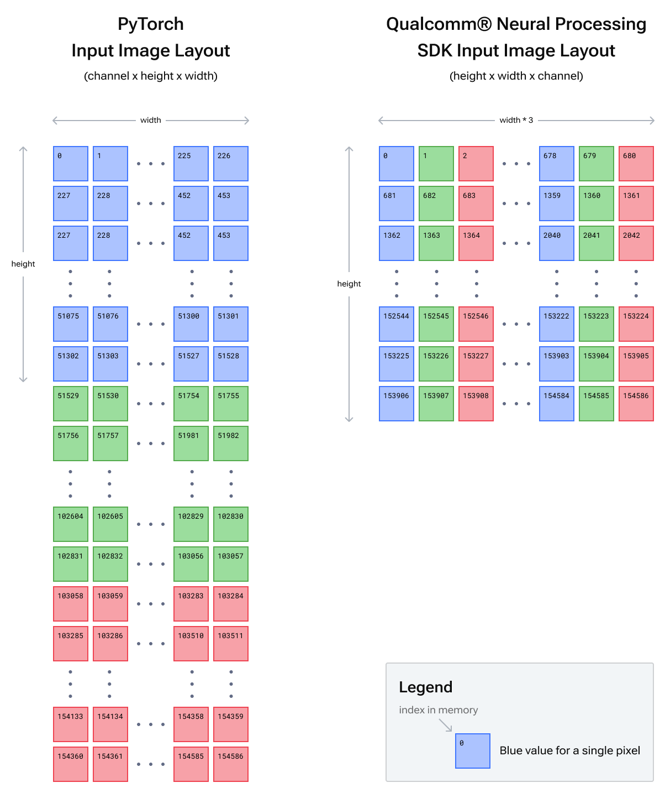

# 07.输入和预处理

## 输入格式

### 输入图像

SNPE还要求输入图像采用可能与原框架不同的特定格式。

在某些框架中，如pytorch, 图像的`tensor shape`为（`batch`  * `channel` * `height` * `width`）, 其中宽度时变换最快的维度，其次时高度， 然后是颜色通道，`这意味着，第一个颜色通道所有的像素在内存中时连续的， 后面时下一个颜色通道的像素值，以此类推。`

在Qualcomm SNPE中， 图像必须呈现为这样的`tensor shape` (`batch` * `height` * `width` * `channel`),` 其中通道是变换最快的通道，这意味着所有像素在内存中连续的， 后面是下一个像素的颜色值，以此类推。 `

如果batch 大于1， 则必须手动地将每个批次地各个图像连接在一起形成单个文件。

### 内存布局图

## MNIST 模型的输入图像

某些框架中的 MNIST 模型（例如 Lenet）需要尺寸为 28x28 的单通道灰度图像。 请注意，虽然只有一个通道，但这些框架 (1x1x28x28) 和 Qualcomm® 神经处理 SDK (1x28x28x1) 中仍然需要 4 维的输入张量。

## 输出

`Pytorch和SNPE的输出是保持一致的` ，一个一维张量，包含批次中每个图像的每个类的概率。

对于 Imagenet 模型（例如 bvlc_alexnet），这是 1000 个 Imagenet 类的大小为 1000 的张量。

如果模型的批量维度大于 1，则各个输出张量将沿着批量维度连接在一起。