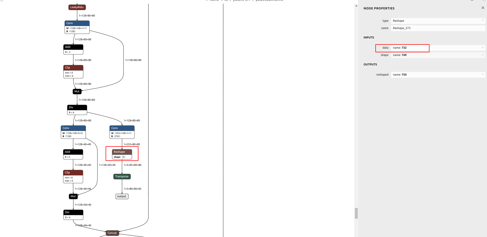
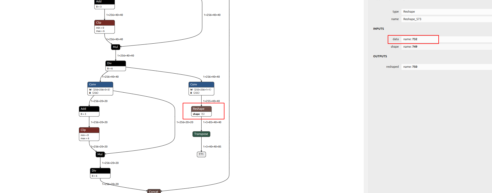
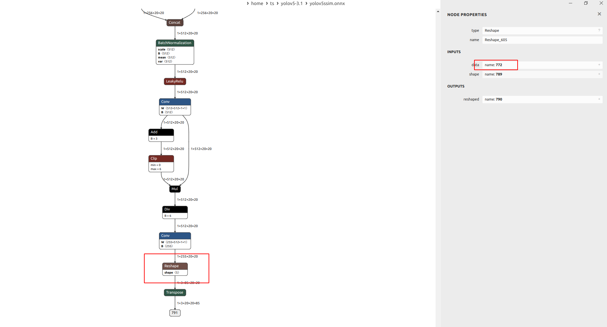
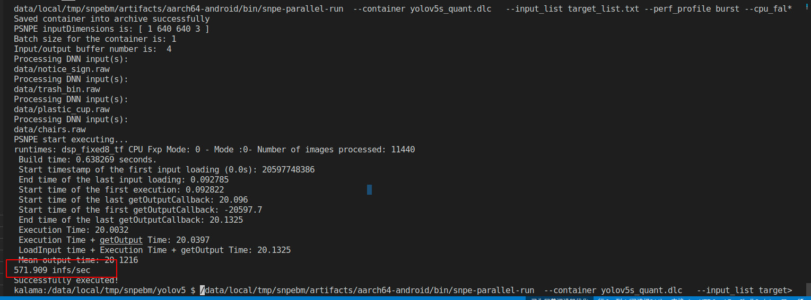

# Yolov5s

1. 从https://github.com/ultralytics/yolov5/releases/tag/v3.1 下载模型和yolov5的代码；

2. 配置环境

   配置python 1.7环境

   ```pythonn
   conda create -n pytorch 1.7 python==3.8
   pip install torch==1.7.1+cpu torchvision==0.8.2+cpu torchaudio==0.7.2 -f https://download.pytorch.org/whl/torch_stable.html
   pip install -r requirest.txt
   ```

3. 模型转换

   ```shell
    python export.py --weights yolov5s.pt --include torchscript onnx
    onnxsim  yolov5s.onnx  yolov5s_sim.onnx 
   ```

4. 做转换和量化

   

   

   

   ```
   snpe-onnx-to-dlc -i yolov5s.onnx --out_node 732 --out_node 752 --out_node 772
   snpe-dlc-quant --input_dlc dlc/yolov5s.dlc --output_dlc dlc/yolov5s_quant.dlc --input_list target_list.txt 
   snpe-dlc-graph-prepare --input_dlc dlc/yolov5s_quant.dlc --output_dlc dlc/yolov5s_quant_cache.dlc  --htp_socs sm8550 --vtcm_override 2
   ```

   

5. 推理

   ```
   export LD_LIBRARY_PATH=/data/local/tmp/snpebm/artifacts/aarch64-android/lib:$LD_LIBRARY_PATH
   export ADSP_LIBRARY_PATH="/data/local/tmp/snpebm/artifacts/aarch64-android/lib;/system/lib/rfsa/adsp;/usr/lib/rfsa/adsp;/system/vendor/lib/rfsa/adsp;/dsp;/etc/images/dsp;"
   cd /data/local/tmp/snpebm/yolov5
   rm -rf output
   
   /data/local/tmp/snpebm/artifacts/aarch64-android/bin/snpe-throughput-net-run --container yolov5s_16_quant_cache.dlc --duration 20 --use_dsp --userbuffer_tf8 --enable_init_cache --perf_profile burst
   
   /data/local/tmp/snpebm/artifacts/aarch64-android/bin/snpe-throughput-net-run --container vgg19_16.dlc    --duration 20 --use_gpu --enable_init_cache --perf_profile burst
   ```
   
   