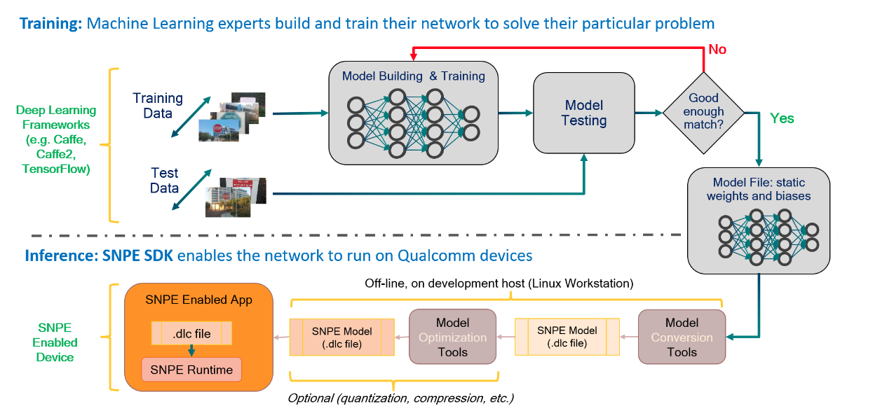
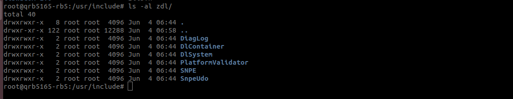
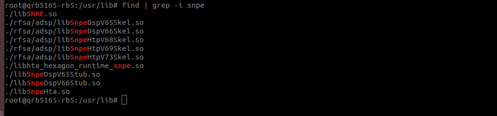
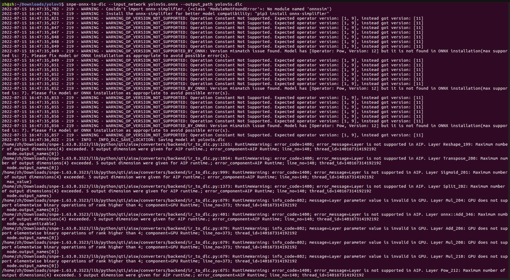

# SNPE Tutorial

[toc]

github 仓库： https://github.com/gesanqiu/SNPE_Tutorial/tree/main

**SNPE 2.0 会逐渐废弃掉C++ API， 转而支持C API作为开发语言。**

SNPE下载地址：https://developer.qualcomm.com/software/qualcomm-neural-processing-sdk

SNPE官方文档地址：https://developer.qualcomm.com/sites/default/files/docs/snpe/overview.html

## 术语表

|      英文简写      |        英文全称         |      含义      |
| :----------------: | :---------------------: | :------------: |
|        dlc         | deep learning container | 深度模型的容器 |
| Model Optimization |                         |    模型量化    |
|                    |                         |                |


## Model Workflow



上图展示了如何将一个训练好的模型在SNPE环境下部署的Workflow。主要有一下四个步骤：

- Model Convert: 将tf/.tflite/.onnx/caffe/.pt等训练好的网络模型转化成一个能够被SNPE加载的DLC文件。
- Benchmark： 量化模型，一边能够在Hexagon DSP上运行。可选项
- SNPETask: 使用SNPE runtime加载模型并完成推理。
- YOLOv5s： Pre-process(输入预处理)和Post-process(处理输出)。

## Environment Prepare

1. 将SNPE_ROOT/include/zdl 头文件夹放置到开发板的/usr/include 下。

   

2. 将SNPE_ROOT/lib/aarch64-ubuntu-gcc7.5 动态库放置到开发板的/usr/lib下。

   

3. 将SNPE_ROOT/lib/dsp 的动态库放置到开发板的/usr/lib/rfsa/adsp下面

   

## Model Convert

【注】：模型转换在x86 PC上进行，需要预先完成[SNPE Setup](https://developer.qualcomm.com/sites/default/files/docs/snpe/setup.html)。

模型转换本身并不复杂，因为模型本身只代表一系列运算(算子Ops)，但是不同的框架(也可以说是不同的硬件平台所导致的)使用了不同的规范和实现，在各个框架之间做模型转换，通常会借助ONNX(Open Neural Network Exchange)这一规范来完成。

```shell
snpe-onnx-to-dlc --input_network models/bvlc_alexnet/bvlc_alexnet/model.onnx
                 --output_path bvlc_alexnet.dlc
```

SNPE将onnx模型转换为dlc的命令很简单，转换失败最主要的原因就是算子不支持，这个需要自行去一层一层网络进行排查，转换失败的log也会给出一些提示。

注：SNPE支持的ONNX算子可以在[Support ONNX Ops](https://developer.qualcomm.com/sites/default/files/docs/snpe/supported_onnx_ops.html)中查到。

注：SNPE支持的网络层可以在[Supported Network Layers](https://developer.qualcomm.com/sites/default/files/docs/snpe/network_layers.html)中查到。

### Convert YOLOv5s.onnx



1. WARNING_OP_VERSION_NOT_SUPPORTED：可以忽略

2. RuntimeWarning：error_message=Layer is not supported in AIP：可以忽略。

   Log输出为AIP Runtime不支持`Reshape_199`，`Transpose_200`等layers，原因是AIP只支持4-dimension的输入输出数据，而`Reshape_199`等layers的尺寸为5-dimensions，但如 SNPETask中`setCPUFallbackMode()`章节所言，runtime不支持的layers会被fullback到CPU上运行，因此并不会影响前向推理。

注：本sample采用去除Reshape和Concat等layers之后转出来的dlc为例，yolov5s.dlc和yolov5s_full.dlc两者在使用上的差距体现在 `yolov5s/YOLOv5sImpl.cpp`中的 `PostProcess()`函数中，在 `PostProcess()`的第142-173行我们做的工作就是将将 `1x80x80x255`，`1x40x40x255`，`1x20x20x255`的三个输出层数据拷贝到到一个 `1x25200x85`的buffer中。

注：yolov5s_full.dlc的后处理可以参考[yolov5-opencv-cpp-python](https://github.com/doleron/yolov5-opencv-cpp-python)中的 `detect()`函数。

## Model Quantize

## 源码分析

### Get Avaliable Runtime

检测当前的设备是否支持指定的runtime。

`zdl::SNPE::SNPEFactory::isRuntimeAvailable(runtime)`

```c++
zdl::DlSystem::Runtime_t checkRuntime(zdl::DlSystem::Runtime_t runtime, bool &staticQuantization)
{
    static zdl::DlSystem::Version_t Version = zdl::SNPE::SNPEFactory::getLibraryVersion();

    std::cout << "SNPE Version: " << Version.asString().c_str() << std::endl; //Print Version number

   if((runtime != zdl::DlSystem::Runtime_t::DSP) && staticQuantization)
   {
      std::cerr << "ERROR: Cannot use static quantization with CPU/GPU runtimes. It is only designed for DSP/AIP runtimes.\n";
      std::cerr << "ERROR: Proceeding without static quantization on selected runtime.\n";
      staticQuantization = false;
   }

    if (!zdl::SNPE::SNPEFactory::isRuntimeAvailable(runtime))
    {
        std::cerr << "Selected runtime not present. Falling back to CPU." << std::endl;
        runtime = zdl::DlSystem::Runtime_t::CPU;
    }

    return runtime;
}
```

### Load Network

### Load UDO

### Set Network Builder Options

### Load Network Inputs

1. Using ITensors 普通的用户内存在被GPU、DSP等设备访问的时候是需要做一次内存拷贝，将普通的用户内存拷贝到相应的硬件内存上去。
2. Using User Buffers 可以直接被GPU、DSP使用。

Execute the network & Process Output

1. Using ITensors
2. Using User Buffers


