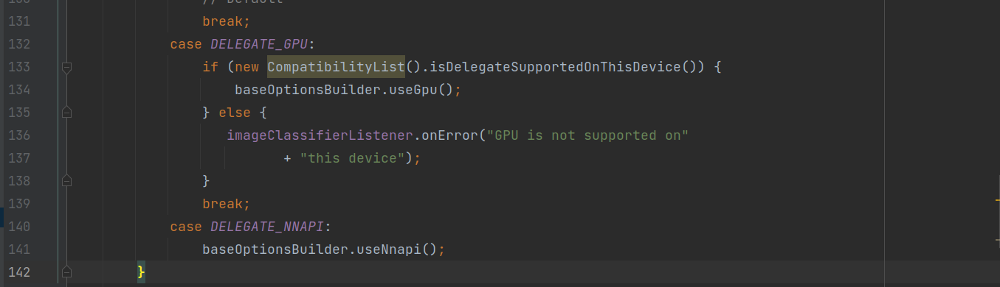
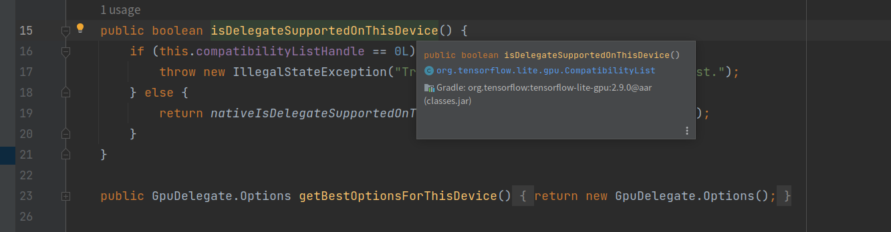
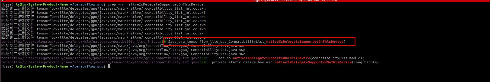
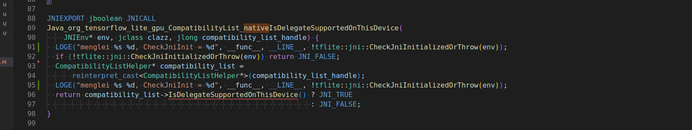

# TensorFlow 常见问题

## Tensorflow 编译

1. 下载tensorflow的源码
2. 配置android sdk, NDK等环境，记住安装的位置；
3. 配置./config进行配置
4. 进行编译（编译过程中需要从网络上下载某些工具和文件，需要科学上网）。

## GPU delegate 不能使用

- 问题描述

  > 客户使用tensorflow 官网的android demon app **image classification** 发现GPU delegate 不可用， 已知平台GPU为Adreno 702。
  >
  > https://github.com/tensorflow/examples/tree/master/lite/examples/image_classification/android
  >
  > 

- 问题分析

  - 在imagClassifierHelper.java 中， 问题是发生在133行

    

  - 查找isDelegateSupportOnThisDevice() 

    

    可以得知这个函数是tensorflow的代码，调用了nativeIsDelegateSupportedOnThisDevice()， 这个函数通过JNI 调用底层的函数

  - 在源码中查看

    

    在tensorflow/lite/delegates/gpu/java/src/main/native/compatibility_list_jni.cc 文件中找到了它

    

    代码逻辑很简单，先是判断JNI是否正常的初始化，之后对compatibility_list_handle做一个强转，之后调用IsDelegateSupportedOnThisDevice。

    `这里讲一下如何在JNI C++ 端添加LOG`

    > ```C++
    > #include <android/log.h>
    > 
    > #ifndef LOG_TAG
    > #define LOG_TAG "TOF_RAW_OF"
    > #define LOGD(...) __android_log_print(ANDROID_LOG_DEBUG,LOG_TAG ,__VA_ARGS__) // 定义LOGD类型
    > #define LOGI(...) __android_log_print(ANDROID_LOG_INFO,LOG_TAG ,__VA_ARGS__) // 定义LOGI类型
    > 
    > #define LOGW(...) __android_log_print(ANDROID_LOG_WARN,LOG_TAG ,__VA_ARGS__) // 定义LOGW类型
    > #define LOGE(...) __android_log_print(ANDROID_LOG_ERROR,LOG_TAG ,__VA_ARGS__) // 定义LOGE类型
    > #define LOGF(...) __android_log_print(ANDROID_LOG_FATAL,LOG_TAG ,__VA_ARGS__) // 定义LOGF类型
    > #endif
    > 
    > 使用：
    > LOGE("menglei %s %d !database_ = %d",  __func__, __LINE__, !database_); 
    > // __func__ 函数名
    > // __LINE__ 行号
    > ```

  - IsDelegateSupportedOnThisDevice 

    ```c++
      bool IsDelegateSupportedOnThisDevice() {
        return compatibility_list_->Includes(android_info_, gpu_info_);
      }
    ```

  - Includes

    ```C++
    bool GPUCompatibilityList::Includes(
        const AndroidInfo& android_info,
        const ::tflite::gpu::GpuInfo& gpu_info) const {
      auto variables = CalculateVariables(android_info, gpu_info);
      LOGE("menglei %s %d variables[gpu::kStatus] = %s",  __func__, __LINE__, variables[gpu::kStatus].c_str()); 
      LOGE("menglei %s %d std::string(gpu::kStatusSupported) = %s",  __func__, __LINE__, std::string(gpu::kStatusSupported).c_str()); 
      return variables[gpu::kStatus] == std::string(gpu::kStatusSupported);
    }
    ```

    variables[gpu::kStatus] == std::string(gpu::kStatusSupported) 注意到这个gpu::kStatusSupported 是一个宏定义， 为`SUPPORTTED` 字符串。

    但是此时的variables[gpu::kStatus]  打印出来是空，所以返回了false

  - 问题落在了 CalculateVariables(android_info, gpu_info) 函数上

    ```c++
    std::map<std::string, std::string> GPUCompatibilityList::CalculateVariables(
        const AndroidInfo& android_info,
        const ::tflite::gpu::GpuInfo& gpu_info) const {
      std::map<std::string, std::string> variables;
    
      variables[kAndroidSdkVersion] = android_info.android_sdk_version;
      variables[kDeviceModel] = android_info.model;
      variables[kDeviceName] = android_info.device;
      variables[kManufacturer] = android_info.manufacturer;
      const auto& gl_info = gpu_info.opengl_info;
      variables[kGPUModel] = gl_info.renderer_name;
      char buffer[128];
      int len = snprintf(buffer, 128 - 1, "%d.%d", gl_info.major_version,
                         gl_info.minor_version);
      buffer[len] = '\0';
      variables[kOpenGLESVersion] = std::string(buffer);
      CanonicalizeValues(&variables);
      LOGE("menglei %s %d !database_ = %d",  __func__, __LINE__, !database_); 
      if (!database_) return variables;
      UpdateVariablesFromDatabase(&variables, *database_);
       LOGE("menglei %s %d !database_ = %d",  __func__, __LINE__, !database_); 
      return variables;
    }
    ```

    通过代码可以看出只有  UpdateVariablesFromDatabase(&variables, *database_);才能使得variables[gpu::kStatus]  map 内容改变, 但这个函数前后加上了LOG发现，并没有变化，说明database\_存在问题。

    ```c++
    void UpdateVariablesFromDatabase(
        std::map<std::string, std::string>* variable_values,
        const DeviceDatabase& database) {
      if (!database.root()) return;
      for (const DeviceDecisionTreeNode* root : *(database.root())) {
        Follow(root, variable_values);
      }
    }
    ```

  - 主要需要看一下database 是如何修改的，因为我们的设备可能并不支持tensorflow

    主要结合 https://github.com/tensorflow/tensorflow/commit/369ea2ba6ea6b80e7aca406f895d822aac069a78

    和/tensorflow_src/tensorflow/lite/experimental/acceleration/compatibility/README.md 进行修改测试。

  