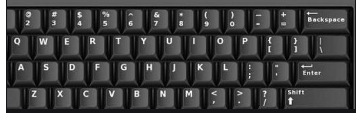

# vim

https://zhuanlan.zhihu.com/p/68111471

VIM 在Linux系统中有一个配置文件 ～.vimrc, 这个文件可用于配置VIM。

VIM 有四种模式

- 普通模式
- 插入模式
- 命令模式
- 可视模式

## 切换模式

两种方式

1. <ESC> 键 快速切换到正常模式。
2. Ctrl  + ]  (但是<ESC>键有些特殊，它脱离了主键盘区，所以用这个组合键替代)

可以在～/.vimrc文件中进行配置

```shell
 #将ESC键映射为两次j键                                      
inoremap jj <Esc>
```

## 打开文件

- 打开一个或者多个文件

```sh
vim file1 file2 .....
```

- 打开多个文件如何切换文件

  ```shell
  ls 				# 会列出所有VIM打开的所有文件
  
  b2			# 这个命令会显示第二个文件
  
  ```

## 分屏显示

- 上下分屏

  ```shell
  vim -o2 file1, file2					# 分2个屏幕，显示这两个文件
  ```

- 左右分屏

  ```shell
  vim -O3 file1, file2				# 分3个屏幕，显示这两个文件
  ```

## 分屏操作

在已经打开一个文件的基础上

- 上下分割

  ```shell
  :sp file
  ```
  
- 左右分割

  ```shell
  vsp file
  ```

## 分屏后切换光标



1. 切换左右光标（第三个小写）

   ```shell
   Ctrl + w h
   ```

   h：左

   j：下

   k：上

   l：右

2. 移动分屏（第三个参数大写）

   ```
   Ctrl + w H			// 将当前屏幕移动至左边
   ```

   H：左

   J：下

   K：上

   L：右

