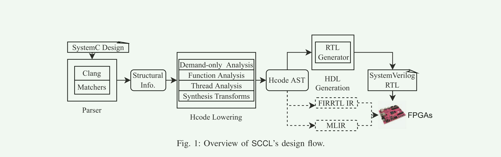
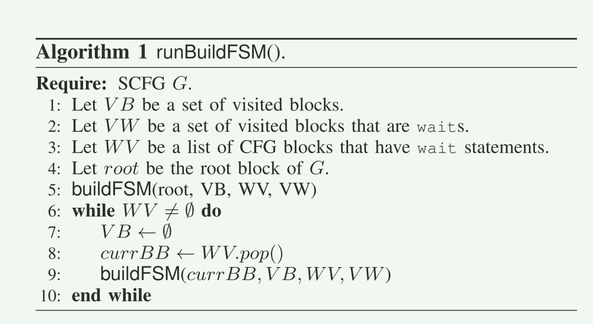
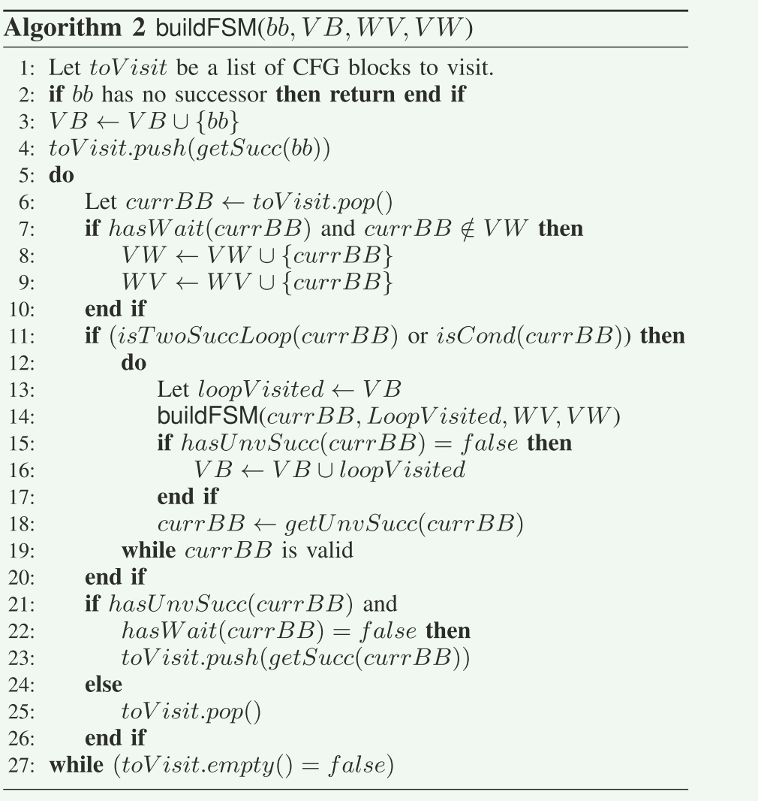

#  SCCL: An open-source SystemC to RTL translator

## Abstract

1. Clang前端来分析systemc

2. 特定用于Systemc的中间抽象语法数Hcode

   简化了到其他中间格式的翻译

3. 所有案例研究均在Xilinx Zynq UltraScale+ FPGA平台上部署和执行

## 贡献:

1. 提出了SCCL，一个基于Clang的开源工具，用于将SystemC 设计转换为可合成的RTL。SCCL接受Accellera合成标准的一个子集[3]，并支持复杂的C++结构，如类，类继承，模板类型，用户定义类和虚函数。

2. 提出了一个算法，转换SystemC线程进程的状态机。这些状态机可以直接转换为RTL。

3. 引入了一个SystemC特定的中间AST，Hcode，它简化了到其他低级IR（如FIRRTL）和SystemVerilog或VHDL的转换。

4. 我们通过四个案例研究探索SCCL的使用。

   第一个案例研究是一个移动平均滤波器，通常用作流媒体应用程序中的一个组件。

   第二个是ZFP [1]，[5]设计，专注于对高性能科学计算至关重要的新型浮点压缩技术。

   第三个是矩阵乘法的脉动阵列设计，它是许多机器学习应用程序的底层组件之一。

   最后一个案例研究是使用SystemC线程进程的整数除法器。

   **SCCL的源代码和案例研究**可以通过访问。**这个已经下载到**

## 相关的工作

1. 最近，随着Chisel、PyMTL和ROHD等框架的创新，生成硬件的语言和框架出现了复苏。在本节中，我们主要集中讨论从SystemC生成硬件的综合方法。

2. 一般来说，从SystemC生成RTL有动态和静态方法。

   动态方法通过执行SystemC仿真的一部分（称为细化）来执行设计，细化具体化设计信息，如模块实例、它们的端口绑定和网表。

   静态方法分析SystemC源代码以提取相关的设计信息。

   虽然动态方法支持灵活性，但静态方法是self-documenting，因为它们不依赖于运行时信息。

   因此，**SCCL选择使用静态方法**。

3. 我们的努力包括[7]-[9]。[7]的作者提出了一个SystemC和Verilog之间的双向编译器。但是，似乎缺少对类、类层次结构、虚函数和模板类型的支持。[8]中的作者提出了一种分析SystemC设计的工具，但不支持将其转换为门。最有前途的方法是英特尔的SystemC编译器[9]（ICSC），这是一种动态方法，它可以将SystemC设计转换为支持多种C++结构的可综合Verilog。ICSC的首次公开发布是在2020年底，SCCL开发了几年，由于ICSC当时还处于起步阶段，我们发现语言支持并不完整。公务员制度委员会取得了进一步进展，今后将考虑与其翻译进行比较。此外，我们希望有一条从SystemC到其他目标语言的路径，比如通过FIRRTL到Chisel，以及可能的其他中间表示，比如MLIR，据我们所知，ICSC中没有计划。作为这样一个路径的概念证明，我们的工具的目标是一个内部的中间表示，Hcode，以平衡支持SystemC功能和服从合成之间的复杂性，其中其他中间表示努力在后者，但缺乏在前者。我们把扩展留给其他中间表示作为未来的工作。

4. SCCL包括支持从生成的**SystemVerilog合成FPGA比特流并在Xilinx Pynq板上运行生成的设计**。SCCL的理念是保持开源和社区驱动和支持

## Translation systemc to RTL

1. Hcode AST在SCCL的设计流程中起着核心作用。Hcode构造描述了SystemC实例，并在简化的AST中表达了SystemC进程的行为。

   这个简化的Hcode AST使得转录到可合成的RTL变得简单。

   请注意，Hcode AST被精心设计为与目标语言无关，并允许转换为其他常用的IR，如FIRRTL。Hcode操作码类别如表I所示。

   在Hcode降低阶段，SCCL执行多个分析。

   接下来我们简要描述这些分析的一个子集。



1. Parser

   SCCL 使用Clang 来解析和创建AST， 匹配器遍历AST来识别和提取SystemC的信息， 结构化的信息可以快速访问底层的AST以及systemc设计中定义的线程的CFG. 

2. Synthesizable channel type  不清楚有什么用。

3. Hcode AST 在 SCCL 的设计流程中发挥着核心作用。 Hcode 构造描述了 SystemC 实例，并以简化的 AST 表达了 SystemC 进程的行为。这种简化的 Hcode AST 使转录到可合成的 RTL 变得简单。

   - 有多种分析，图上可以看出有四种。

   - Thread Analysis
   
     进程有两种形式， methods 和 threads
   
     method processes 可以转换成SystemC verilog中的always。
   
     线程进程需要转换成语义上等效的RTL.
   
     thread processes 
   
     A key distinguishing aspect about thread processes is **that it encourages the use of wait statements**. 
   
     SystemC designs that use threads need to be converted into their c**orresponding state machines.** 
   
     **Although this is not synthesis in the classical sense, the process of translating SystemC threads to state machines does result in assigning clock cycles to operations.** 
   
     SCCL **uses a novel algorithm** to translate SystemC threads **into state machines amenable to synthesis.**
   
      The algorithm has two steps. 
   
     - The first step converts the thread process’s control-flow graph (CFG) into a suspension CFG graph (SCFG) that separates every CFG block with one or more wait statements such that every wait statement has its own CFG block. This is done while preserving predecessor and successor edges. 
     - The second step uses runBuildFSM and buildFSM from Algorithms 1 and 2, which uses a recursive algorithm mimicking a depth-first-search variant to traverse the SCFG and construct the CFG blocks that must execute in each corresponding state of the state machine. For brevity, we abstract the algorithm to focus on the traversal. We do not show the transformation from Clang’s CFG to SCFG, and the collection of CFG blocks that provide the resulting RTL code.
   
     - buildFSM
   
       
   
       
   
     ---
   
     * *在这里可以增加数据竞争分析， 存储到这种Hcode中*

​      

```verilog
function automatic void for_stmt_wait0_func ();
begin
case(state_for_stmt_wait0)
0: begin
k_scclang_global_1 = 0;
_next_state_for_stmt_wait0 = 1;
return;
end
end
...
endcase
endfunction
always @(*) begin: for_stmt_wait0_state_update
state_for_stmt_wait0 = _next_state_for_stmt_wait0;
wait_counter_for_stmt_wait0 =
_next_wait_counter_for_stmt_wait0;
wait_next_state_for_stmt_wait0 =
_next_wait_next_state_for_stmt_wait0;
_main_k_scclang_global_1 = k_scclang_global_1;
for_stmt_wait0_func();
end
```


   
