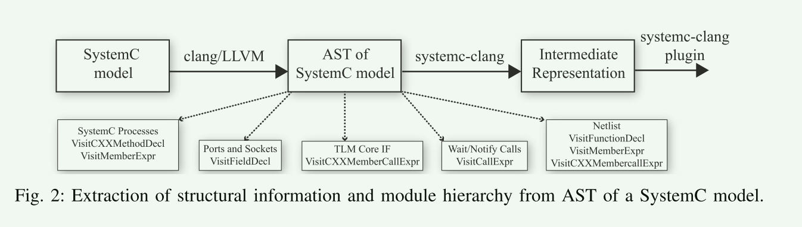
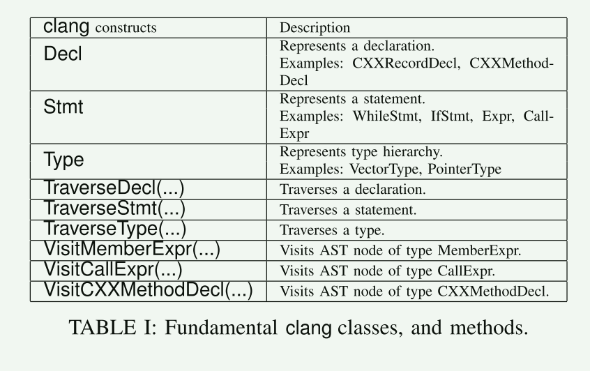

# systemc-clang: An Open-source Framework for Analyzing Mixed-abstraction SystemC Models

## abstract

1.  systemc-clang 的开源框架，用于分析由寄存器传输级和事务级组件混合组成的 SystemC 模型。

2. 该框架静态解析混合抽象 SystemC 模型，并使用中间表示来表示它们。

3. 该中间表示捕获有关模型的结构信息以及模型中流程的某些行为语义。

   这种表示可用于多种目的，例如模型的静态分析、代码转换和优化。

**本文主要写了**
- 描述了实现 systemc-clang 的关键细节，
- 展示了构建一个插件的示例，该插件分析中间表示以发现 SystemC 进程并行执行的机会。
- 使用 SystemC 发行版中的示例子集（包括寄存器传输和事务级模型）来实验性地评估该框架的功能。

## Introduce

需要一种允许设计人员在电子设计自动化社区中分析 SystemC 模型的框架。

- 静态方法

  - 使用静态分析方法来解析 SystemC 源代码，并提取存储在中间表示中的结构和行为信息。
  - 使用静态方法的示例包括 SystemPerl 、KaSCPar 、Scoot  和 SystemCXML 仅支持 RTL 模型，不支持 TLM的分析。 
  - HIFSuite 是一个例外，它是一个用于分析 RTL 和 TLM的商业框架。

- 动态方法

  - 认为模型的某些方面只能在运行时确定。

  - PinaVM 就是这样的框架之一。

## clang background

其实systemc-clang 是基于llvm clang开发的一个插件。 

- clang 是 LLVM [16] 的开源前端，它是一个拥有活跃社区和行业支持的编译器。例如，NVIDIA、Intel、AMD 等行业都在提供 LLVM 的扩展，以实现特定语言的支持和优化。

- 选择 clang 而不是 GCC 前端的原因是 clang 提供了富有表现力的诊断和错误报告。

- 它还提供对用户友好且易于理解的抽象语法树 (AST) 的访问。

- 此外，clang 社区还有一组有用的插件，例如 Polly [17]（LLVM 的多面体优化器）和 clang 静态分析器 [18]（自动发现 bug 的源代码分析框架）。

- 它的快速普及以及它作为 GCC 替代品的地位进一步促使我们选择以 clang 为基础的 systemc-clang。 

- clang 提供了两个主要的 AST 遍历器：ASTVisitor 和 RecursiveASTVisitor。

  - 两者之间的主要区别在于 RecursiveASTVisitor 递归访问所有 AST 节点，而 ASTVisitor 不递归。

  - 在systemc-clang中，我们使用RecursiveASTVisitor对AST进行深度顺序遍历并访问每个节点。

    它执行三个不同的任务：使用 TraverseDecl(Decl*)、TraverseStmt(Stmt*) 和 TraverseType(Type*) 等方法遍历 AST；*

    遍历类层次结构直到到达基类并使用虚拟可重写函数访问特定节点。例如，virtual bool VisitCXXMemberCallExpr(CXXMemberCallExpr*) 是一个遍历 CXXMemberCallExpr 类型的节点的虚拟方法。

    

clang 中的关键基类是 Stmt、Decl 和 Type。表一列出了基本的 clang 类型以及从基本类继承的类的示例。图 1 显示了 systemc-clang 中的一个类的片段，该类提取通过套接字接口在启动器和目标之间通信的通用有效负载信息。通用有效负载由一组使用某些公共方法设置的属性组成。例如，可以使用set command()访问函数设置读/写命令，并且可以使用set address()方法设置目标存储器映射的起始地址。图 3 显示了用于设置通用负载属性的 AST。可以看出，set command() 和 set address() 方法的 AST 节点的类型为 CXXMemberCallExpr。因此，在 FindPayloadCharacteristics 类中，我们使用虚拟可重写函数 virtual bool VisitCXXMemberCallExpr() 来遍历 CXXMemberCallExpr 类型的节点。用于定义通用有效负载属性的公共方法采用单个参数。因此，我们使用 CXXMemberCallExpr 类的公共成员函数 getArg() 来提取特定属性的参数名称。由于有效负载的属性是在 SystemC 进程中设置的，因此 FindPayloadCharacteristics 类构造函数将 CXXMethodDecl 实例作为参数，它表示类/结构的方法实例。