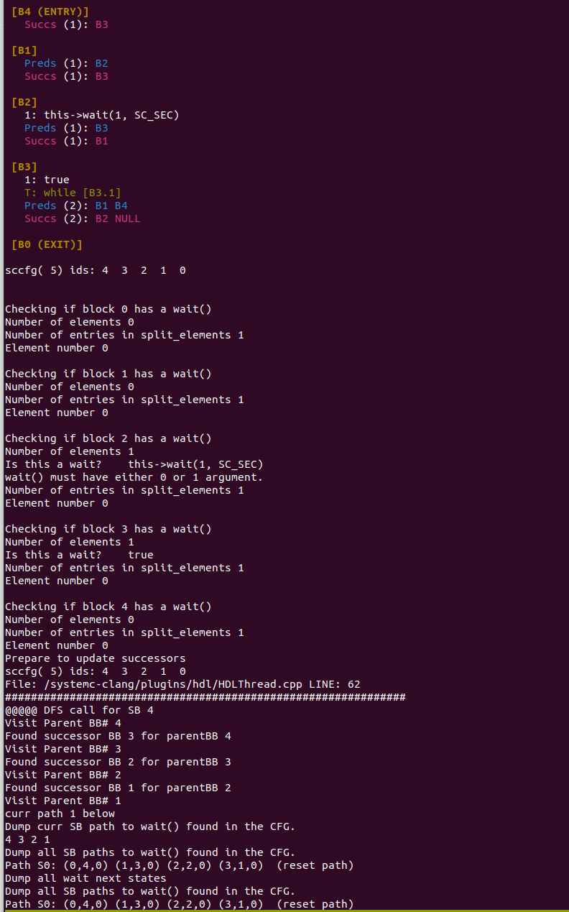
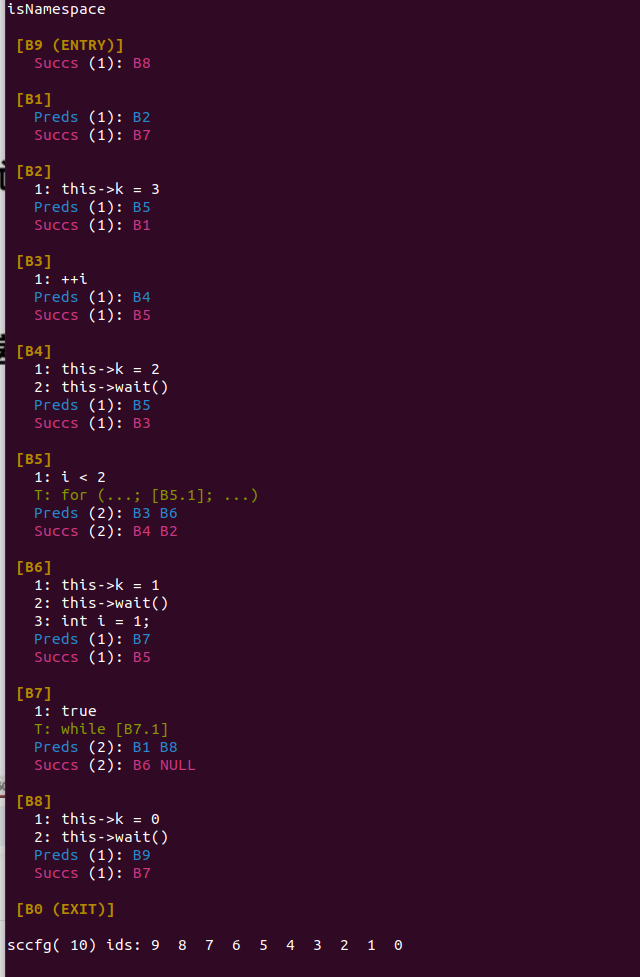

# 1226

## SCFG 图

```c++
// Learn with Examples, 2020, MIT license
#include <systemc>
using namespace sc_core;

SC_MODULE(PROCESS) {
  sc_clock clk; // declares a clock
  SC_CTOR(PROCESS) : clk("clk", 1, SC_SEC) { // instantiate a clock with 1sec periodicity
    SC_THREAD(thread); // register a thread
  }
  void thread() { // define the thread member function
    while (true) { // infinite loop make sure it never exits 
      wait(1, SC_SEC); // wait 1 sec before execute again
    }
  }
};

int sc_main(int, char*[]) {
  PROCESS process("process"); // init module
  sc_start(2, SC_SEC); // run simulation for 2 second
  return 0;
}
```

```shell
root@m:/systemc-clang# /systemc-clang-build/systemc-clang ultra96-vitis-ae/moving-average-d16-w16/simu_process.cpp  -- -x c++ -w -c -D__STDC_CONSTANT_MACROS -D__STDC_LIMIT_MACROS -DRVD -I/opt/clang-13.0.0/lib/clang/13.0.0/include/ -I/usr/include -I/opt/systemc-2.3.3/include -I/systemc-clang/fccm-case-studies/moving-average -I/systemc-clang/fccm-case-studies/zfpsynth
```






```shell

```

