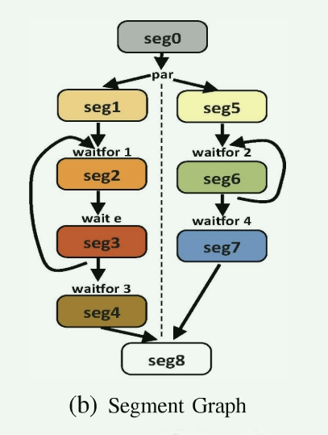

#  论文的主要想法


### 示例代码：

```c++
#include <stdio.h>
int x = 0, y;
behavior B1(event e)
{
    void main() {
        int i = 0;
        do {
            waitfor 1;
            wait e;
            x = i;
        }while (i ++ < 2);
        waitfor 3;
        x = 27; }
};
behaviror B2(event e)
{
    void main() {
        int i = 0;
        do {
            waitfor 2;
            y = i;
            notify e;
        }while (i++ < 2);
        waitfor 4;
        x = 42; }
}
behaviror Main()
{
    event e;
    B1 b1(e);
    B2 b2(e);
    par{
        b1.main();
        b2.main();
    }
}
```

## Thread Analysis

Thread Analysis 负责 分析线程中的那些函数会成为system进程；上面的代码经过分析得出代码中共有两个线程。

## 可能发生数据竞争的行号

全局变量有三个 event e,  x, y, 

数据竞争发生的行号：9, 10， 13， 21，22,  25

## Segment Analysis

主要的任务是对进程函数进行分段，分段的原则

1. 对全局变量不能存在读写访问的最大代码段设为一个段；
2. 对全局变量存在读写访问的最大代码段设为一个段；

### 分段优化

```c++
global int x = 0, y;

void threadFunc() {
    int i = 0;
    x = 2;
    int j = 0;
    y = 1;
}
```

如果按照上面的原则， 那么会存在四个段， 即： 4， 5， 6， 7 行各为一段；

经过分析上面的代码可以等效成下面的代码：

```c++
global int x = 0, y;

void threadFunc() {
    int i = 0;
    int j = 0;
    x = 2;
    y = 1;
}
```

**这样， 程序只会形成两个段；**

### 代码中的段

经过上面的分段后， 示例代码可以变成如下的段；


### 竞争数据竞争分析


### 执行流图




```verilog
`timescale 1ps/1ps
module Main;
initial begin
        seg0;
        fork
            seg1;
    		seg5;
            end
        fork
        	seg6;
        	seg2;
            seg3
            end
        seg4;
        seg7;
        seg8;
end
endmodule
```


## 下一步需要做的是：

1. 熟悉代码， 尝试增加数据竞争的逻辑

