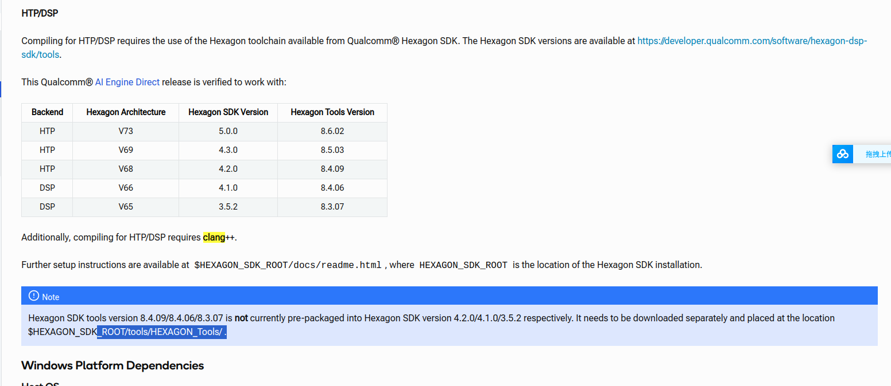

# QNN SETUP

搭建环境Ubuntu

```shell
conda create -n qnn python=3.8
python3 -m pip install --upgrade pip
${QNN_SDK_ROOT}/bin/check-python-dependency
sudo apt-get install make
wget -c https://dl.google.com/android/repository/android-ndk-r25c-linux.zip
export ANDROID_NDK_ROOT=<PATH-TO-NDK>
export PATH=${ANDROID_NDK_ROOT}:${PATH}
${QNN_SDK_ROOT}/bin/envcheck -n
${QNN_SDK_ROOT}/bin/envcheck -c

```




source QNN and Hexagon and download tools.

pip install tensorflow==2.10.1

pip show tensorflow

```shell
export TENSORFLOW_HOME=/home/ts/anaconda3/envs/qnn/lib/python3.8/site-packages

```

