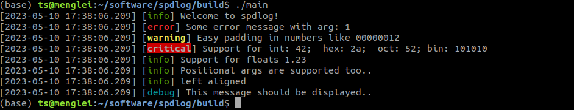
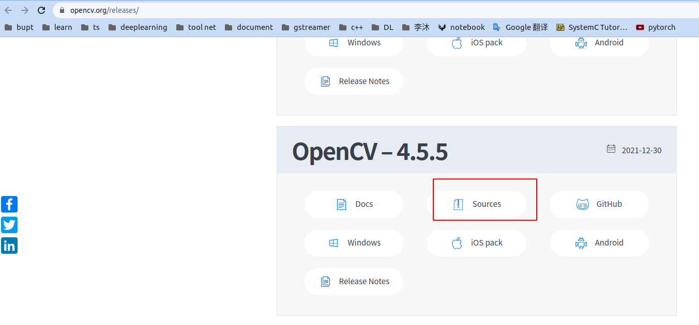
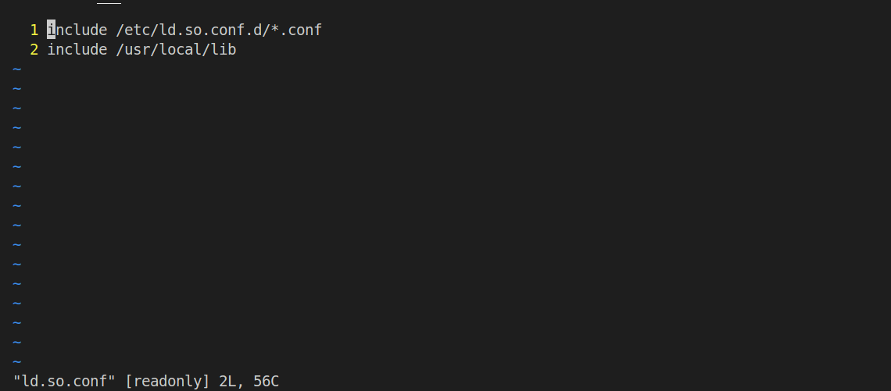
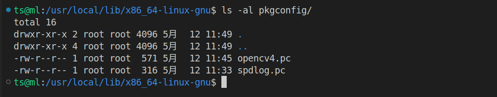

基于ubuntu 18.04 LTS


[toc]

# spdlog

1. 从gitlab下载: https://github.com/gabime/spdlog

2. 解压

3. ```shell
   cd  spdlog
   mkdir build
   cmake ..
   make -j16
   make install
   ```

4. test

   ```c++
   #include "spdlog/spdlog.h"
   
   int main() 
   {
       spdlog::info("Welcome to spdlog!");
       spdlog::error("Some error message with arg: {}", 1);
       
       spdlog::warn("Easy padding in numbers like {:08d}", 12);
       spdlog::critical("Support for int: {0:d};  hex: {0:x};  oct: {0:o}; bin: {0:b}", 42);
       spdlog::info("Support for floats {:03.2f}", 1.23456);
       spdlog::info("Positional args are {1} {0}..", "too", "supported");
       spdlog::info("{:<30}", "left aligned");
       
       spdlog::set_level(spdlog::level::debug); // Set global log level to debug
       spdlog::debug("This message should be displayed..");    
       
       // change log pattern
       spdlog::set_pattern("[%H:%M:%S %z] [%n] [%^---%L---%$] [thread %t] %v");
       
       // Compile time log levels
       // define SPDLOG_ACTIVE_LEVEL to desired level
       SPDLOG_TRACE("Some trace message with param {}", 42);
       SPDLOG_DEBUG("Some debug message");
   }
   ```

   - Compiler 

     ```
     gcc main.cpp -o main
     ```

   - 执行

     ```shell
     ./main
     ```

     

# opencv 

1. 源码下载

   下载地址[OpenCV官网](https://links.jianshu.com/go?to=https%3A%2F%2Fopencv.org%2Freleases%2F)，选择最新的4.4.0版本(如果下载速度太慢，复制链接地址，使用迅雷)

   

2. 依赖软件

     - cmake

     - ```shell
       sudo apt-get install build-essential pkg-config libgtk2.0-dev libavcodec-dev libavformat-dev libjpeg-dev libswscale-dev libtiff5-dev
       ```

3. 安装

     ```shell
     unzip opencv-4.5.5.zip
      cd opencv-4.5.5
     mkdir build
     cmake -D CMAKE_BUILD_TYPE=RELEASE -D CMAKE_INSTALL_PREFIX=/usr/local -D WITH_GTK=ON -D OPENCV_GENERATE_PKGCONFIG=YES ..
     ```

     CMAKE_BUILD_TYPE=RELEASE：表示编译发布版本
     CMAKE_INSTALL_PREFIX：表示生成动态库的安装路径，可以自定义
     WITH_GTK=ON：这个配置是为了防止GTK配置失败：即安装了libgtk2.0-dev依赖，还是报错未安装
     OPENCV_GENERATE_PKGCONFIG=YES：表示自动生成OpenCV的pkgconfig文件，否则需要自己手动生成。

     ```shell
     make -j16 && sudo make install
     ```

4. 环境配置
- 将OpenCV的库添加到系统路径
- 方法一：配置ld.so.conf文件

​				sudo vim /etc/ld.so.conf
​				在文件中加上一行 include /usr/loacal/lib，这个路径是cmake编译时填的动态库安装路径加上/lib

​				

​    方法二: 

​		


-  **配置系统bash**
  因为在cmake时，选择了自动生成OpenCV的pkgconfig文件，在`/usr/local/lib/x86_64-linux-gnu/pkgconfig`路径可以看到文件opencv4.pc

  

  确保文件存在，执行如下命令

  ```shell
  sudo vim /etc/bash.bashrc
  ```

  在文末添加

  ```shell
  PKG_CONFIG_PATH=$PKG_CONFIG_PATH:/usr/local/lib/pkgconfig
  export PKG_CONFIG_PATH
  ```

至此，Linux\Ubuntu18.04环境下OpenCV的安装以及配置已经全部完成，可以使用以下命令查看是否安装和配置成功

```shell
pkg-config --modversion opencv4
pkg-config --cflags opencv4
pkg-config --libs opencv4
```
